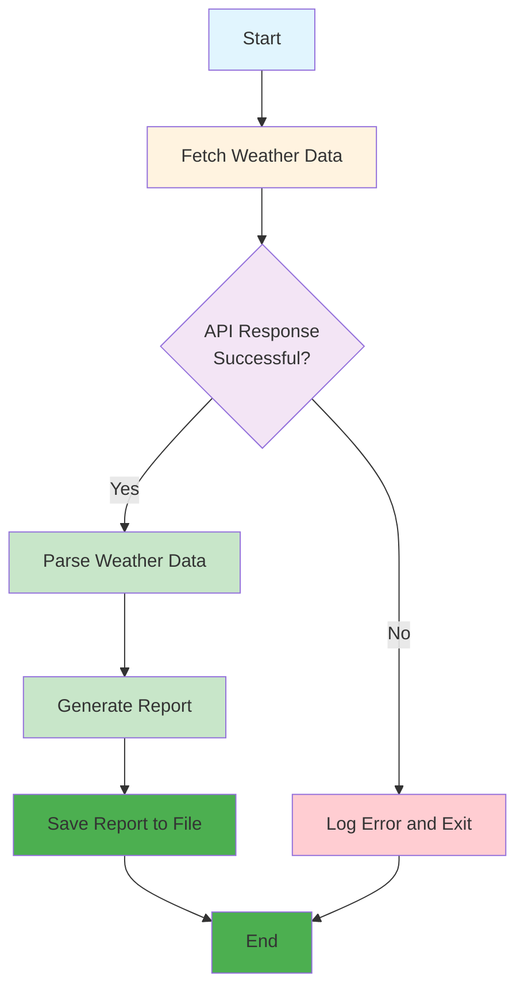

# Fixed Automation Agent Example: Weather Reporter

## Overview

This example demonstrates a **Level -1: Fixed Automation** agent that fetches weather data from an API and generates a simple report. This agent follows rigid, pre-programmed instructions without any intelligence or adaptation, but is enhanced with **Ollama** for better report generation.

### Why Ollama Enhancement?

- **🆓 Free**: No API costs for report enhancement
- **🔒 Private**: All processing happens locally
- **⚡ Fast**: No network latency for LLM calls
- **🛠️ Customizable**: Use any compatible model
- **📱 Offline**: Works without internet connection
- **📈 Better Reports**: AI-generated weather summaries

## What This Agent Does

- Fetches weather data from OpenWeatherMap API
- Generates a simple text report
- **Enhanced with Ollama** for AI-generated weather summaries
- Saves the report to a file
- Runs on a fixed schedule (every hour)

## Key Characteristics of Fixed Automation

- **No decision-making** - Follows exact script
- **No adaptation** - Cannot handle unexpected inputs
- **High efficiency** - Fast execution for repetitive tasks
- **Predictable behavior** - Always produces the same output format
- **Fails on errors** - Cannot recover from API failures or unexpected responses

## How It Works



## Files in This Example

- `weather_agent.py` - Main agent implementation
- `config.py` - Configuration settings
- `requirements.txt` - Python dependencies
- `README.md` - This documentation

## Usage

1. **Install Ollama**: Visit [ollama.ai](https://ollama.ai/) and install Ollama
2. **Setup Ollama**: Run `python setup_ollama.py` to download the required model
3. **Install dependencies**: `pip install -r requirements.txt`
4. **Set up your API key** in `config.py` (optional)
5. **Run the agent**: `python weather_agent.py`

### Quick Start with Ollama

```bash
# Install Ollama (if not already installed)
# Visit https://ollama.ai/ and follow installation instructions

# Setup the required model
python setup_ollama.py

# Install Python dependencies
pip install -r requirements.txt

# Run the agent
python weather_agent.py
```

## Limitations

This agent demonstrates the limitations of fixed automation:
- Cannot handle API failures gracefully
- Cannot adapt to different weather conditions
- Cannot learn from past interactions
- Cannot make decisions about what to do with the weather data
- Cannot handle unexpected API response formats

## When to Use Fixed Automation

This type of agent is perfect for:
- ✅ Simple, repetitive tasks
- ✅ Well-defined inputs and outputs
- ✅ Tasks that don't require decision-making
- ✅ High-volume, low-complexity operations

## When NOT to Use Fixed Automation

This type of agent is NOT suitable for:
- ❌ Tasks requiring decision-making
- ❌ Handling unexpected inputs
- ❌ Learning from experience
- ❌ Adapting to changing conditions
- ❌ Complex problem-solving

## Next Steps

If you need more sophisticated capabilities, consider:
- **Level 0: LLM-Enhanced** - For understanding natural language weather queries
- **Level 1: ReAct** - For reasoning about weather data and making decisions
- **Level 2: ReAct + RAG** - For accessing additional weather knowledge sources
- **Level 3: Tool-Enhanced** - For integrating multiple weather services and tools

---

*This example is part of the [AI Agent Hierarchy](../Agent-Types.md). Learn about more advanced agent types to find the right solution for your needs.*
