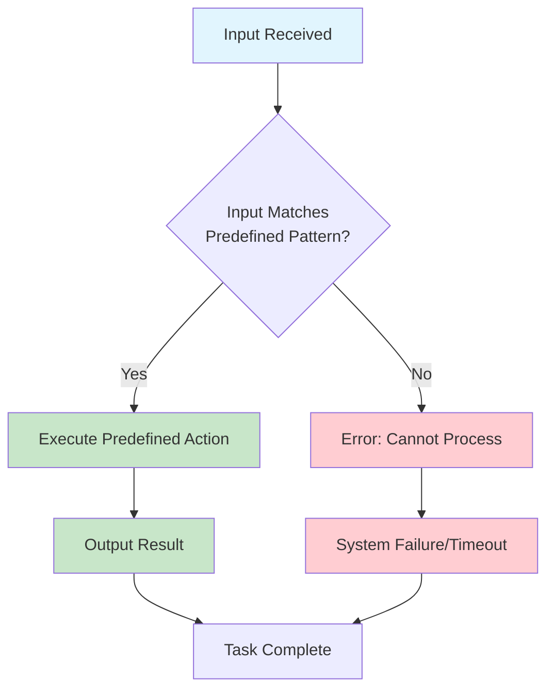
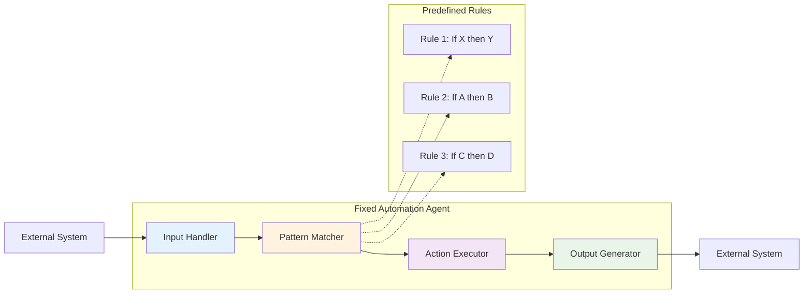

# Level -1: Fixed Automation – The Digital Assembly Line

## Overview

Fixed Automation agents represent the simplest and most rigid form of automation. These agents don't adapt or think—they just execute pre-programmed instructions. They are like assembly-line workers in a digital factory: efficient but inflexible.

## Key Characteristics

- **No decision-making capabilities** - Follows exact scripts without deviation
- **High efficiency** for repetitive, well-defined tasks
- **Zero adaptability** - Fails when encountering unplanned scenarios
- **Predictable behavior** - Always produces the same output for the same input
- **Low computational requirements** - Minimal processing power needed

## How It Works



## Architecture Diagram



## Best Use Cases

### ✅ Perfect For:
- **Data entry automation** - Converting structured data from one format to another
- **Simple email responses** - Auto-replies to common inquiries
- **Basic form processing** - Validating and storing form submissions
- **Scheduled system backups** - Automated file and database backups
- **File organization tasks** - Moving files based on naming conventions
- **Basic calculations** - Mathematical operations with fixed formulas

### ❌ Not Suitable For:
- **Dynamic decision making** - Any scenario requiring judgment calls
- **Customer service** - Handling unique or complex customer issues
- **Content analysis** - Understanding context or meaning
- **Adaptive workflows** - Processes that need to change based on conditions
- **Error recovery** - Handling unexpected situations gracefully

## Real-World Examples

### Example 1: Email Auto-Responder
```python
# Simple email auto-responder
def process_email(incoming_email):
    if "unsubscribe" in incoming_email.subject.lower():
        return send_unsubscribe_confirmation()
    elif "support" in incoming_email.subject.lower():
        return send_support_acknowledgment()
    else:
        return send_generic_response()
```

### Example 2: File Organizer
```python
# Automated file organization
def organize_files(file_path):
    if file_path.endswith('.pdf'):
        move_to_folder(file_path, '/documents/pdfs/')
    elif file_path.endswith('.jpg'):
        move_to_folder(file_path, '/images/')
    elif file_path.endswith('.txt'):
        move_to_folder(file_path, '/documents/text/')
```

## Implementation Considerations

### Pros:
- **Reliable** - Consistent behavior every time
- **Fast** - Minimal processing overhead
- **Simple** - Easy to understand and maintain
- **Cost-effective** - Low computational requirements
- **Predictable** - Easy to test and debug

### Cons:
- **Inflexible** - Cannot handle variations or edge cases
- **Brittle** - Breaks when inputs don't match expected patterns
- **Limited scope** - Only suitable for very specific, repetitive tasks
- **No learning** - Cannot improve or adapt over time
- **Maintenance heavy** - Requires manual updates for new scenarios

## When to Choose Fixed Automation

Choose Fixed Automation when:
- ✅ The task is **highly repetitive** and **well-defined**
- ✅ Input variations are **minimal** and **predictable**
- ✅ **Speed and reliability** are more important than flexibility
- ✅ You have **limited computational resources**
- ✅ The process is **unlikely to change** frequently

## Next Steps

If you find that your Fixed Automation agent is:
- **Failing frequently** due to unexpected inputs → Consider **Level 0: LLM-Enhanced**
- **Needing to handle variations** in input → Consider **Level 0: LLM-Enhanced**
- **Requiring decision-making** capabilities → Consider **Level 1: ReAct**

---

*This agent type is part of the [AI Agent Hierarchy](./Agent-Types.md). Learn about more advanced agent types to find the right solution for your needs.*
