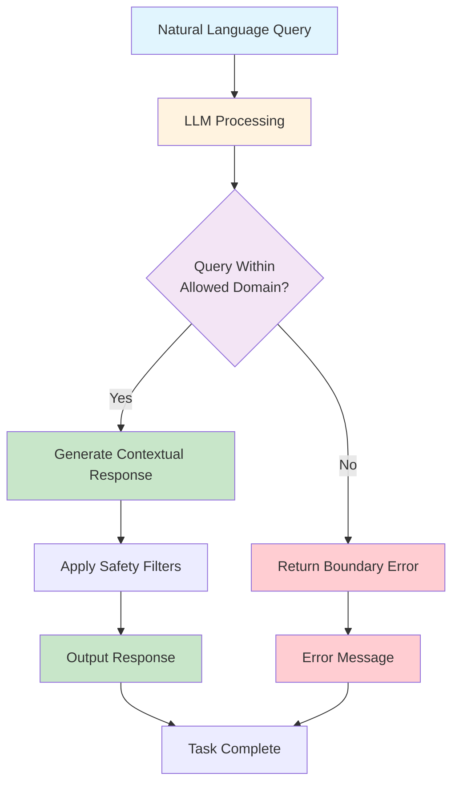

# LLM-Enhanced Agent Example: Natural Language Weather Assistant

## Overview

This example demonstrates a **Level 0: LLM-Enhanced** agent that can understand natural language weather queries and provide contextual responses. This agent uses **Ollama** for local LLM processing, providing cost-effective and privacy-preserving AI capabilities while operating within strict boundaries.

### Why Ollama?

- **🆓 Free**: No API costs or usage limits
- **🔒 Private**: All processing happens locally
- **⚡ Fast**: No network latency for LLM calls
- **🛠️ Customizable**: Use any compatible model
- **📱 Offline**: Works without internet connection

## What This Agent Does

- Understands natural language weather queries
- Provides contextual responses based on user intent
- Handles ambiguous inputs and variations in phrasing
- Operates within predefined boundaries and safety constraints
- Generates human-like responses while maintaining control

## Key Characteristics of LLM-Enhanced Agents

- **Contextual understanding** - Can interpret meaning and intent
- **Handles ambiguous inputs** - Understands variations in how requests are phrased
- **Operates within strict boundaries** - Limited to predefined domains and capabilities
- **High-volume processing** - Efficient for repetitive but varied tasks
- **Natural language processing** - Can understand and generate human-like text

## How It Works



## Files in This Example

- `llm_weather_agent.py` - Main LLM-enhanced agent implementation
- `config.py` - Configuration settings and boundaries
- `requirements.txt` - Python dependencies including LLM libraries
- `README.md` - This documentation

## Usage

1. **Install Ollama**: Visit [ollama.ai](https://ollama.ai/) and install Ollama
2. **Setup Ollama**: Run `python setup_ollama.py` to download the required model
3. **Install dependencies**: `pip install -r requirements.txt`
4. **Run the agent**: `python llm_weather_agent.py`
5. **Test with natural language queries**

### Quick Start with Ollama

```bash
# Install Ollama (if not already installed)
# Visit https://ollama.ai/ and follow installation instructions

# Setup the required model
python setup_ollama.py

# Install Python dependencies
pip install -r requirements.txt

# Run the agent
python llm_weather_agent.py
```

## Capabilities

This agent can handle queries like:
- "What's the weather like today?"
- "Is it going to rain this weekend?"
- "How hot is it in London?"
- "Should I bring an umbrella?"
- "What's the temperature in Paris?"

## Limitations

This agent demonstrates the limitations of LLM-Enhanced agents:
- Cannot make complex decisions about weather data
- Cannot access real-time data sources
- Cannot learn from past interactions
- Cannot integrate with external systems
- Cannot provide personalized recommendations

## When to Use LLM-Enhanced

This type of agent is perfect for:
- ✅ Natural language understanding
- ✅ Contextual responses
- ✅ High-volume, varied queries
- ✅ Human-like interactions
- ✅ Ambiguous input handling

## When NOT to Use LLM-Enhanced

This type of agent is NOT suitable for:
- ❌ Complex decision-making
- ❌ Tool integration
- ❌ Learning from experience
- ❌ High-stakes decisions
- ❌ Real-time system control

## Next Steps

If you need more sophisticated capabilities, consider:
- **Level 1: ReAct** - For reasoning about weather data and making decisions
- **Level 2: ReAct + RAG** - For accessing real-time weather data sources
- **Level 3: Tool-Enhanced** - For integrating multiple weather services
- **Level 4: Self-Reflecting** - For learning from past interactions

---

*This example is part of the [AI Agent Hierarchy](../Agent-Types.md). Learn about more advanced agent types to find the right solution for your needs.*
