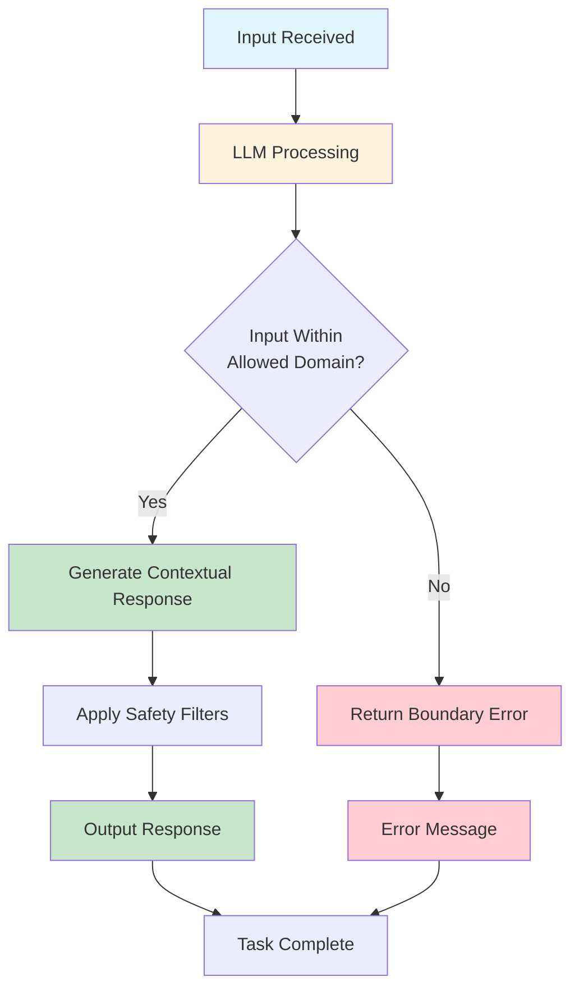
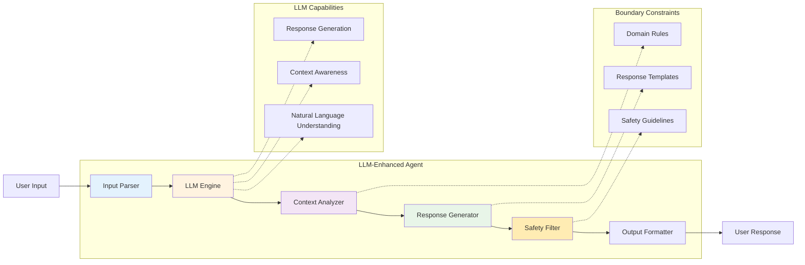

# Level 0: LLM-Enhanced – Smarter, but Not Exactly Einstein

## Overview

LLM-Enhanced agents leverage Large Language Models (LLMs) to provide contextual understanding and handle ambiguous tasks while operating within strict boundaries. These agents balance intelligence and simplicity, making them highly efficient for low-complexity, high-volume tasks.

## Key Characteristics

- **Contextual understanding** - Can interpret meaning and intent
- **Handles ambiguous inputs** - Understands variations in how requests are phrased
- **Operates within strict boundaries** - Limited to predefined domains and capabilities
- **High-volume processing** - Efficient for repetitive but varied tasks
- **Natural language processing** - Can understand and generate human-like text

## How It Works



## Architecture Diagram



## Best Use Cases

### ✅ Perfect For:
- **Customer service chatbots** - Handling common inquiries with natural language
- **Content categorization** - Classifying documents, emails, or posts
- **Basic data analysis** - Extracting insights from structured data
- **FAQ responses** - Answering frequently asked questions
- **Content generation** - Creating simple, templated content
- **Language translation** - Converting text between languages
- **Sentiment analysis** - Determining emotional tone of text

### ❌ Not Suitable For:
- **Complex decision making** - Multi-step reasoning processes
- **Dynamic problem solving** - Tasks requiring strategic thinking
- **Tool integration** - Using external APIs or databases
- **Learning and adaptation** - Improving based on past interactions
- **High-stakes decisions** - Critical business or safety decisions

## Real-World Examples

### Example 1: Customer Service Chatbot
```python
# LLM-enhanced customer service
def handle_customer_inquiry(inquiry):
    # LLM processes the inquiry and generates response
    response = llm.generate_response(
        prompt=f"Customer inquiry: {inquiry}",
        constraints=[
            "Only provide information about our products",
            "Be helpful but don't make promises about delivery",
            "Escalate to human if question is about refunds"
        ]
    )
    return response
```

### Example 2: Content Categorizer
```python
# Automated content categorization
def categorize_content(content):
    categories = ["Technology", "Business", "Entertainment", "News"]
    
    response = llm.classify(
        text=content,
        categories=categories,
        instructions="Classify this content into one of the provided categories"
    )
    return response.category
```

## Implementation Considerations

### Pros:
- **Natural language understanding** - Can handle varied input phrasing
- **Contextual awareness** - Understands meaning beyond literal text
- **Scalable** - Can handle high volumes of similar tasks
- **User-friendly** - Provides human-like interactions
- **Flexible within boundaries** - Can handle variations in input

### Cons:
- **Limited scope** - Cannot operate outside predefined boundaries
- **No memory** - Cannot learn from past interactions
- **No tool access** - Cannot interact with external systems
- **Potential for errors** - LLM responses may be inaccurate
- **Resource intensive** - Requires significant computational power

## When to Choose LLM-Enhanced

Choose LLM-Enhanced when:
- ✅ You need **natural language processing** capabilities
- ✅ Tasks involve **understanding context** and **meaning**
- ✅ You want **human-like interactions** but with **controlled scope**
- ✅ You're dealing with **high-volume, similar tasks**
- ✅ You need **flexibility in input handling** but **predictable outputs**

## Common Implementation Patterns

### Pattern 1: Constrained Generation
```python
def generate_response(user_input, constraints):
    prompt = f"""
    User: {user_input}
    
    Constraints:
    - Only discuss topics related to {constraints['domain']}
    - Never provide medical advice
    - Always be helpful and professional
    """
    return llm.generate(prompt)
```

### Pattern 2: Classification with Boundaries
```python
def classify_within_bounds(input_text, allowed_categories):
    response = llm.classify(
        text=input_text,
        categories=allowed_categories,
        fallback="Unable to classify within allowed categories"
    )
    return response
```

## Next Steps

If you find that your LLM-Enhanced agent needs:
- **Multi-step reasoning** capabilities → Consider **Level 1: ReAct**
- **Access to external data** → Consider **Level 2: ReAct + RAG**
- **Tool integration** → Consider **Level 3: Tool-Enhanced**
- **Memory and personalization** → Consider **Level 5: Memory-Enhanced**

---

*This agent type is part of the [AI Agent Hierarchy](./Agent-Types.md). Learn about more advanced agent types to find the right solution for your needs.*
