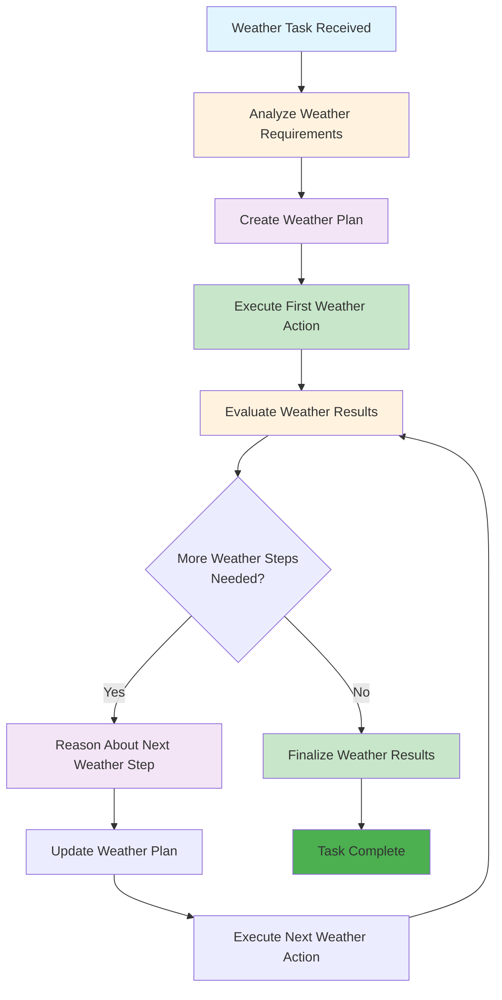

# ReAct Agent Example: Intelligent Weather Planner

## Overview

This example demonstrates a **Level 1: ReAct** agent that combines reasoning and action to perform complex weather-related tasks. The agent can plan, reason through problems, and adapt its approach based on intermediate results using strategic thinking and multi-step decision-making.

## What This Agent Does

- **Strategic Planning** - Breaks down complex weather tasks into manageable steps
- **Multi-step Reasoning** - Plans and executes weather-related activities
- **Adaptive Decision Making** - Adjusts approach based on weather conditions
- **Task Decomposition** - Handles complex weather planning scenarios
- **Dynamic Problem Solving** - Reasons through weather-related challenges

## Key Characteristics of ReAct Agents

- **Strategic thinking** - Can plan and reason through complex problems
- **Multi-step decision making** - Breaks down complex tasks into steps
- **Dynamic problem solving** - Adapts approach based on intermediate results
- **Task decomposition** - Can break large problems into smaller, manageable pieces
- **Adaptive planning** - Adjusts strategy based on new information

## How It Works



## Files in This Example

- `react_weather_agent.py` - Main ReAct agent implementation
- `config.py` - Configuration settings and planning parameters
- `requirements.txt` - Python dependencies
- `README.md` - This documentation

## Usage

1. **Install Ollama**: Visit [ollama.ai](https://ollama.ai/) and install Ollama
2. **Setup Ollama**: Run `python setup_ollama.py` to download the required model
3. **Install dependencies**: `pip install -r requirements.txt`
4. **Set up your API key** in `config.py` (optional)
5. **Run the agent**: `python react_weather_agent.py`

### Quick Start with Ollama

```bash
# Install Ollama (if not already installed)
# Visit https://ollama.ai/ and follow installation instructions

# Setup the required model
python setup_ollama.py

# Install Python dependencies
pip install -r requirements.txt

# Run the agent
python react_weather_agent.py
```

## Capabilities

This ReAct agent can handle complex weather planning tasks like:
- "Plan a weekend outdoor activity based on weather conditions"
- "Create a travel itinerary considering weather forecasts"
- "Optimize my daily schedule based on weather patterns"
- "Plan a garden project considering seasonal weather trends"
- "Create a weather-based exercise routine"

## Limitations

This agent demonstrates the limitations of ReAct agents:
- Cannot access real-time external data sources
- Cannot learn from past interactions
- Cannot integrate with external systems
- Cannot perform physical actions
- Limited to reasoning and planning

## When to Use ReAct

This type of agent is perfect for:
- ✅ Strategic weather planning
- ✅ Multi-step weather-related tasks
- ✅ Complex weather problem solving
- ✅ Adaptive weather planning
- ✅ Weather-based decision making

## When NOT to Use ReAct

This type of agent is NOT suitable for:
- ❌ Real-time weather monitoring
- ❌ Tool integration with weather services
- ❌ Learning from past weather patterns
- ❌ High-stakes weather decisions
- ❌ Environmental control systems

## Next Steps

If you need more sophisticated capabilities, consider:
- **Level 2: ReAct + RAG** - For accessing real-time weather data sources
- **Level 3: Tool-Enhanced** - For integrating multiple weather services
- **Level 4: Self-Reflecting** - For learning from past weather planning
- **Level 5: Memory-Enhanced** - For personalized weather experiences

---

*This example is part of the [AI Agent Hierarchy](../Agent-Types.md). Learn about more advanced agent types to find the right solution for your needs.*
