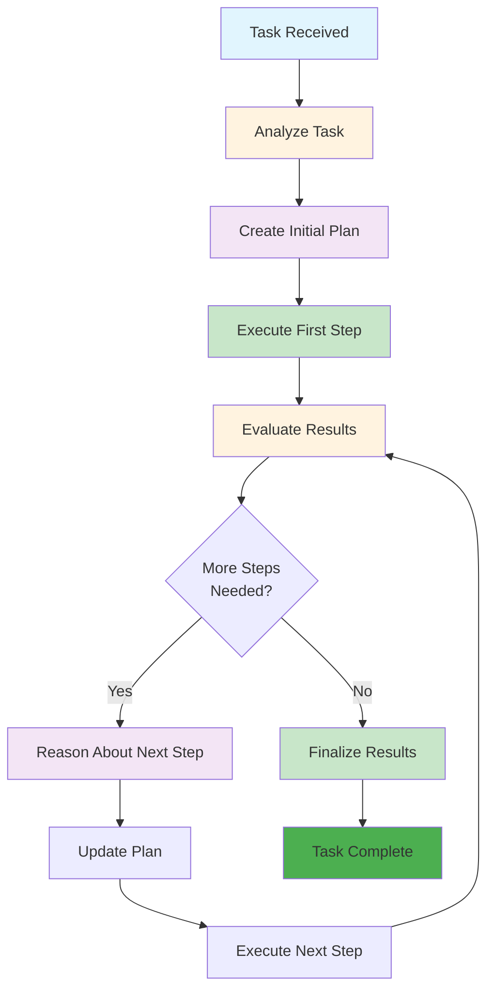
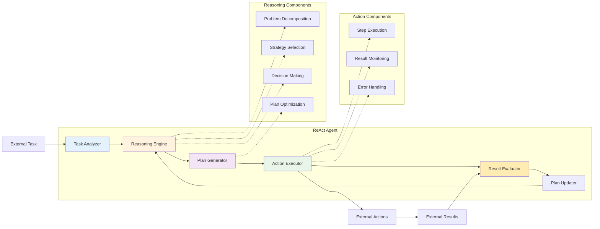

# Level 1: ReAct – Reasoning Meets Action

## Overview

ReAct agents combine Reasoning and Action to perform tasks that involve strategic thinking and multi-step decision-making. They break complex tasks into manageable steps, dynamically reasoning through problems and acting based on their analysis. These agents are like your type-A friend who plans their weekend down to the minute.

## Key Characteristics

- **Strategic thinking** - Can plan and reason through complex problems
- **Multi-step decision making** - Breaks down complex tasks into steps
- **Dynamic problem solving** - Adapts approach based on intermediate results
- **Task decomposition** - Can break large problems into smaller, manageable pieces
- **Adaptive planning** - Adjusts strategy based on new information

## How It Works



## Architecture Diagram



## Best Use Cases

### ✅ Perfect For:
- **Project management** - Breaking down complex projects into phases
- **Research tasks** - Systematic investigation and analysis
- **Problem diagnosis** - Troubleshooting technical issues
- **Workflow optimization** - Improving business processes
- **Strategic planning** - Long-term goal setting and execution
- **Content creation** - Multi-step writing and editing processes
- **Data analysis** - Systematic data exploration and insights

### ❌ Not Suitable For:
- **Real-time decision making** - Tasks requiring immediate responses
- **High-stakes decisions** - Critical business or safety decisions
- **Tool integration** - Tasks requiring external system access
- **Learning from experience** - Improving based on past interactions
- **Environmental control** - Tasks requiring system manipulation

## Real-World Examples

### Example 1: Project Management Agent
```python
# ReAct project management agent
class ProjectManagerAgent:
    def execute_project(self, project_description):
        # Step 1: Analyze project requirements
        analysis = self.analyze_requirements(project_description)
        
        # Step 2: Create project plan
        plan = self.create_project_plan(analysis)
        
        # Step 3: Execute project phases
        for phase in plan.phases:
            result = self.execute_phase(phase)
            if result.status == "failed":
                # Reassess and adjust plan
                plan = self.adjust_plan(plan, result)
            elif result.status == "success":
                # Move to next phase
                continue
        
        return self.finalize_project(plan)
```

### Example 2: Research Agent
```python
# ReAct research agent
class ResearchAgent:
    def conduct_research(self, research_question):
        # Step 1: Break down research question
        sub_questions = self.decompose_question(research_question)
        
        # Step 2: Research each sub-question
        findings = []
        for question in sub_questions:
            result = self.research_question(question)
            findings.append(result)
            
            # Step 3: Evaluate findings and adjust approach
            if result.confidence < 0.7:
                # Research more deeply
                additional_research = self.deep_research(question)
                findings.append(additional_research)
        
        # Step 4: Synthesize findings
        return self.synthesize_findings(findings)
```

## Implementation Patterns

### Pattern 1: Iterative Planning
```python
def iterative_planning(task):
    plan = create_initial_plan(task)
    
    while not plan.is_complete():
        step = plan.get_next_step()
        result = execute_step(step)
        
        if result.success:
            plan.mark_step_complete(step)
        else:
            plan.adjust_based_on_result(step, result)
    
    return plan.get_final_result()
```

### Pattern 2: Adaptive Strategy
```python
def adaptive_strategy(problem):
    strategy = select_initial_strategy(problem)
    
    while not problem.is_solved():
        action = strategy.get_next_action()
        result = execute_action(action)
        
        if result.requires_strategy_change():
            strategy = select_new_strategy(problem, result)
        else:
            strategy.update_based_on_result(result)
    
    return problem.get_solution()
```

## Implementation Considerations

### Pros:
- **Strategic thinking** - Can handle complex, multi-step problems
- **Adaptive planning** - Adjusts approach based on results
- **Systematic approach** - Breaks down complex tasks methodically
- **Self-correcting** - Can identify and fix mistakes
- **Scalable reasoning** - Can handle problems of varying complexity

### Cons:
- **No external knowledge** - Cannot access real-time information
- **No tool integration** - Cannot interact with external systems
- **No memory** - Cannot learn from past experiences
- **Computational intensive** - Requires significant processing power
- **Limited to reasoning** - Cannot perform physical actions

## When to Choose ReAct

Choose ReAct when:
- ✅ You need **strategic thinking** and **planning** capabilities
- ✅ Tasks involve **multi-step processes** and **complex reasoning**
- ✅ You want **systematic problem-solving** approaches
- ✅ You need **adaptive planning** based on intermediate results
- ✅ You're dealing with **complex, non-routine tasks**

## Common Use Cases

### Use Case 1: Business Process Optimization
```python
def optimize_business_process(process_description):
    # Analyze current process
    analysis = analyze_process(process_description)
    
    # Identify bottlenecks and inefficiencies
    bottlenecks = identify_bottlenecks(analysis)
    
    # Create optimization plan
    plan = create_optimization_plan(bottlenecks)
    
    # Execute optimizations
    for optimization in plan.optimizations:
        result = implement_optimization(optimization)
        if result.success:
            plan.mark_complete(optimization)
        else:
            plan.adjust_approach(optimization, result)
    
    return plan.get_optimized_process()
```

### Use Case 2: Technical Troubleshooting
```python
def troubleshoot_technical_issue(issue_description):
    # Analyze the issue
    analysis = analyze_issue(issue_description)
    
    # Create diagnostic plan
    plan = create_diagnostic_plan(analysis)
    
    # Execute diagnostics
    for diagnostic in plan.diagnostics:
        result = run_diagnostic(diagnostic)
        if result.identifies_root_cause():
            return create_solution_plan(result)
        else:
            plan.adjust_diagnostics(result)
    
    return plan.get_troubleshooting_result()
```

## Next Steps

If you find that your ReAct agent needs:
- **Access to external data** → Consider **Level 2: ReAct + RAG**
- **Tool integration** → Consider **Level 3: Tool-Enhanced**
- **Self-reflection capabilities** → Consider **Level 4: Self-Reflecting**
- **Memory and learning** → Consider **Level 5: Memory-Enhanced**

---

*This agent type is part of the [AI Agent Hierarchy](./Agent-Types.md). Learn about more advanced agent types to find the right solution for your needs.*
