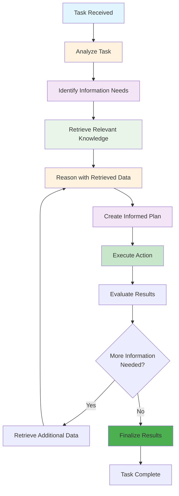
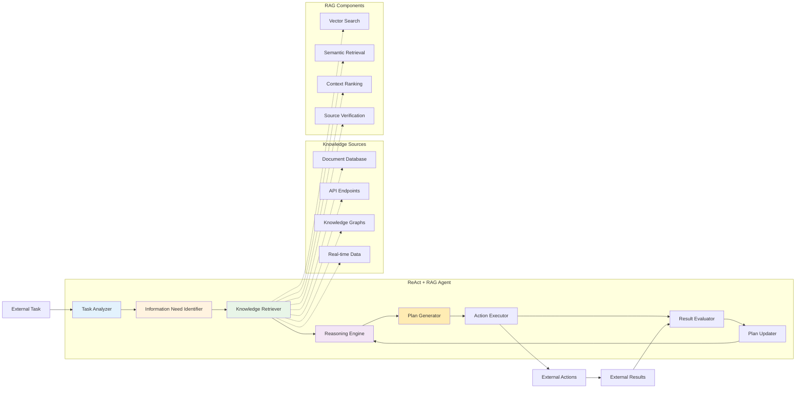

# Level 2: ReAct + RAG – Grounded Intelligence

## Overview

ReAct + RAG (Retrieval-Augmented Generation) agents combine reasoning, action, and real-time access to external knowledge sources. This integration allows them to make informed decisions grounded in accurate, domain-specific data, making them ideal for high-stakes or precision-critical tasks.

## Key Characteristics

- **Real-time knowledge access** - Can retrieve current information from external sources
- **Domain-specific expertise** - Access to specialized knowledge bases
- **Informed decision making** - Decisions based on relevant, up-to-date information
- **High-stakes task handling** - Suitable for critical business and safety decisions
- **Precision-critical operations** - Accurate, evidence-based responses

## How It Works



## Architecture Diagram



## Best Use Cases

### ✅ Perfect For:
- **Medical diagnosis support** - Evidence-based medical recommendations
- **Legal research** - Case law analysis and legal advice
- **Financial analysis** - Market research and investment decisions
- **Technical troubleshooting** - Complex system diagnosis
- **Research and development** - Scientific research and innovation
- **Compliance monitoring** - Regulatory compliance checking
- **Quality assurance** - Standards-based quality control

### ❌ Not Suitable For:
- **Real-time environmental control** - Tasks requiring immediate system manipulation
- **Personalized experiences** - Tasks requiring user-specific memory
- **Self-improvement** - Tasks requiring learning from past experiences
- **Tool integration** - Tasks requiring complex multi-system orchestration
- **Autonomous learning** - Tasks requiring self-directed improvement

## Real-World Examples

### Example 1: Medical Diagnosis Support
```python
# ReAct + RAG medical diagnosis agent
class MedicalDiagnosisAgent:
    def diagnose_patient(self, symptoms, patient_history):
        # Step 1: Retrieve relevant medical literature
        medical_knowledge = self.retrieve_medical_knowledge(symptoms)
        
        # Step 2: Analyze symptoms with medical context
        analysis = self.analyze_symptoms(symptoms, medical_knowledge)
        
        # Step 3: Create diagnostic plan
        plan = self.create_diagnostic_plan(analysis, patient_history)
        
        # Step 4: Execute diagnostic tests
        for test in plan.tests:
            result = self.execute_diagnostic_test(test)
            if result.requires_additional_research():
                # Retrieve more specific medical information
                additional_knowledge = self.retrieve_specific_knowledge(test, result)
                plan.update_with_knowledge(additional_knowledge)
        
        return self.generate_diagnosis(plan)
```

### Example 2: Legal Research Agent
```python
# ReAct + RAG legal research agent
class LegalResearchAgent:
    def research_legal_issue(self, legal_question, jurisdiction):
        # Step 1: Retrieve relevant case law
        case_law = self.retrieve_case_law(legal_question, jurisdiction)
        
        # Step 2: Analyze legal precedents
        analysis = self.analyze_legal_precedents(case_law, legal_question)
        
        # Step 3: Create research plan
        plan = self.create_research_plan(analysis)
        
        # Step 4: Execute research steps
        for step in plan.research_steps:
            result = self.execute_research_step(step)
            if result.identifies_new_precedents():
                # Retrieve additional case law
                additional_cases = self.retrieve_additional_cases(result)
                plan.update_with_cases(additional_cases)
        
        return self.synthesize_legal_advice(plan)
```

## Implementation Patterns

### Pattern 1: Knowledge-Driven Planning
```python
def knowledge_driven_planning(task, knowledge_sources):
    # Retrieve relevant knowledge
    knowledge = retrieve_relevant_knowledge(task, knowledge_sources)
    
    # Create plan based on knowledge
    plan = create_plan_with_knowledge(task, knowledge)
    
    # Execute plan with continuous knowledge updates
    while not plan.is_complete():
        step = plan.get_next_step()
        result = execute_step(step)
        
        if result.requires_knowledge_update():
            additional_knowledge = retrieve_knowledge_for_result(result)
            plan.update_with_knowledge(additional_knowledge)
        
        plan.mark_step_complete(step)
    
    return plan.get_final_result()
```

### Pattern 2: Evidence-Based Decision Making
```python
def evidence_based_decision_making(decision_context, evidence_sources):
    # Gather evidence
    evidence = gather_evidence(decision_context, evidence_sources)
    
    # Analyze evidence
    analysis = analyze_evidence(evidence)
    
    # Make informed decision
    decision = make_informed_decision(analysis)
    
    # Validate decision with additional evidence
    if decision.requires_validation():
        validation_evidence = gather_validation_evidence(decision)
        decision = validate_decision(decision, validation_evidence)
    
    return decision
```

## Implementation Considerations

### Pros:
- **Evidence-based decisions** - All decisions grounded in relevant data
- **Domain expertise** - Access to specialized knowledge
- **Current information** - Can access real-time, up-to-date data
- **High accuracy** - Decisions based on verified information
- **Audit trail** - Can trace decisions back to source information

### Cons:
- **Knowledge dependency** - Quality depends on knowledge source quality
- **Retrieval overhead** - Additional processing time for knowledge retrieval
- **Source verification** - Need to verify and validate information sources
- **Limited to available knowledge** - Cannot reason beyond available information
- **No learning** - Cannot improve from past experiences

## When to Choose ReAct + RAG

Choose ReAct + RAG when:
- ✅ You need **evidence-based decision making**
- ✅ Tasks require **domain-specific expertise**
- ✅ You're dealing with **high-stakes or critical decisions**
- ✅ You need **current, accurate information**
- ✅ You want **auditable, traceable decisions**

## Common Use Cases

### Use Case 1: Financial Analysis
```python
def analyze_investment_opportunity(company, market_data):
    # Retrieve financial data
    financial_data = retrieve_financial_data(company)
    market_knowledge = retrieve_market_analysis(market_data)
    
    # Analyze investment opportunity
    analysis = analyze_investment(financial_data, market_knowledge)
    
    # Create investment recommendation
    recommendation = create_investment_recommendation(analysis)
    
    # Validate with additional market data
    if recommendation.requires_validation():
        additional_data = retrieve_additional_market_data(recommendation)
        recommendation = validate_recommendation(recommendation, additional_data)
    
    return recommendation
```

### Use Case 2: Compliance Monitoring
```python
def monitor_regulatory_compliance(process, regulations):
    # Retrieve relevant regulations
    applicable_regulations = retrieve_applicable_regulations(process, regulations)
    
    # Analyze process compliance
    compliance_analysis = analyze_compliance(process, applicable_regulations)
    
    # Create compliance report
    report = create_compliance_report(compliance_analysis)
    
    # Validate with latest regulatory updates
    if report.requires_validation():
        latest_updates = retrieve_latest_regulatory_updates()
        report = validate_compliance_report(report, latest_updates)
    
    return report
```

## Knowledge Source Integration

### Document Databases
```python
def integrate_document_database(documents):
    # Index documents for retrieval
    index = create_document_index(documents)
    
    # Create retrieval system
    retrieval_system = create_retrieval_system(index)
    
    return retrieval_system
```

### API Endpoints
```python
def integrate_api_endpoints(apis):
    # Create API client
    api_client = create_api_client(apis)
    
    # Create data retrieval system
    retrieval_system = create_api_retrieval_system(api_client)
    
    return retrieval_system
```

## Next Steps

If you find that your ReAct + RAG agent needs:
- **Tool integration** → Consider **Level 3: Tool-Enhanced**
- **Self-reflection capabilities** → Consider **Level 4: Self-Reflecting**
- **Memory and personalization** → Consider **Level 5: Memory-Enhanced**
- **Environmental control** → Consider **Level 6: Environment Controllers**

---

*This agent type is part of the [AI Agent Hierarchy](./Agent-Types.md). Learn about more advanced agent types to find the right solution for your needs.*
