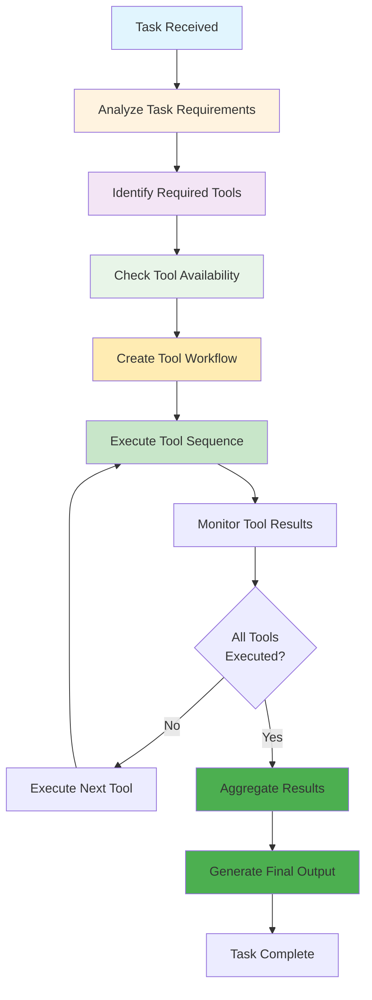
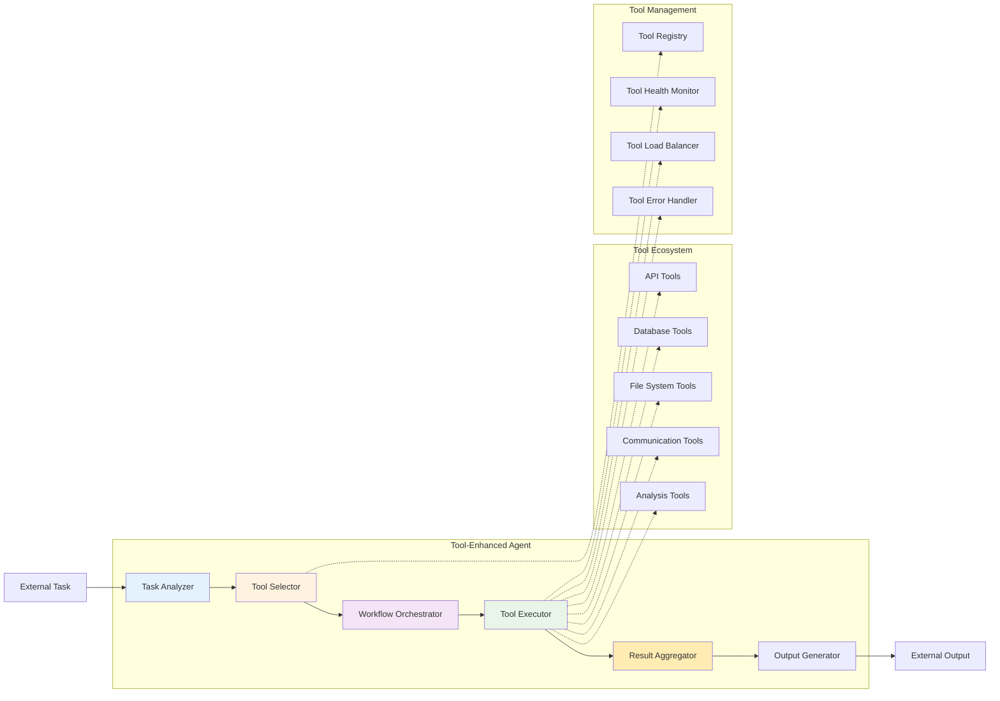

# Level 3: Tool-Enhanced – The Multi-Taskers

## Overview

Tool-enhanced agents are versatile problem solvers integrating multiple tools, leveraging APIs, databases, and software to handle complex, multi-domain workflows. They combine reasoning, retrieval, and execution for seamless, dynamic task completion. Think of them as tech-savvy Swiss Army knives capable of combining reasoning, retrieval, and execution seamlessly.

## Key Characteristics

- **Multi-tool integration** - Can use various tools and systems simultaneously
- **Cross-platform capabilities** - Works across different systems and platforms
- **Dynamic workflow management** - Adapts workflows based on available tools
- **API integration** - Seamlessly connects to external services
- **Database connectivity** - Can access and manipulate data across systems

## How It Works



## Architecture Diagram



## Best Use Cases

### ✅ Perfect For:
- **Business process automation** - End-to-end workflow automation
- **Cross-platform integrations** - Connecting disparate systems
- **Complex data workflows** - Multi-step data processing pipelines
- **Multi-system orchestration** - Coordinating multiple systems
- **Enterprise automation** - Large-scale business process automation
- **Data pipeline management** - ETL and data transformation workflows
- **System monitoring** - Multi-system health and performance monitoring

### ❌ Not Suitable For:
- **Real-time environmental control** - Tasks requiring immediate system manipulation
- **Personalized experiences** - Tasks requiring user-specific memory
- **Self-improvement** - Tasks requiring learning from past experiences
- **Autonomous learning** - Tasks requiring self-directed improvement
- **High-stakes decisions** - Critical decisions without human oversight

## Real-World Examples

### Example 1: Business Process Automation
```python
# Tool-enhanced business process automation
class BusinessProcessAgent:
    def automate_business_process(self, process_definition):
        # Step 1: Analyze process requirements
        requirements = self.analyze_requirements(process_definition)
        
        # Step 2: Select appropriate tools
        tools = self.select_tools(requirements)
        
        # Step 3: Create workflow
        workflow = self.create_workflow(requirements, tools)
        
        # Step 4: Execute workflow
        for step in workflow.steps:
            result = self.execute_tool_step(step)
            if result.success:
                workflow.mark_step_complete(step)
            else:
                # Handle tool failure
                alternative_tool = self.find_alternative_tool(step, result)
                if alternative_tool:
                    workflow.replace_tool(step, alternative_tool)
                else:
                    workflow.mark_step_failed(step)
        
        return workflow.get_final_result()
```

### Example 2: Data Pipeline Management
```python
# Tool-enhanced data pipeline agent
class DataPipelineAgent:
    def manage_data_pipeline(self, pipeline_config):
        # Step 1: Analyze pipeline requirements
        requirements = self.analyze_pipeline_requirements(pipeline_config)
        
        # Step 2: Select data tools
        data_tools = self.select_data_tools(requirements)
        
        # Step 3: Create pipeline workflow
        workflow = self.create_pipeline_workflow(requirements, data_tools)
        
        # Step 4: Execute pipeline
        for stage in workflow.stages:
            result = self.execute_pipeline_stage(stage)
            if result.success:
                workflow.mark_stage_complete(stage)
            else:
                # Handle stage failure
                recovery_plan = self.create_recovery_plan(stage, result)
                workflow.execute_recovery_plan(recovery_plan)
        
        return workflow.get_pipeline_result()
```

## Implementation Patterns

### Pattern 1: Tool Orchestration
```python
def orchestrate_tools(task, available_tools):
    # Analyze task requirements
    requirements = analyze_task_requirements(task)
    
    # Select tools based on requirements
    selected_tools = select_tools(requirements, available_tools)
    
    # Create tool workflow
    workflow = create_tool_workflow(requirements, selected_tools)
    
    # Execute workflow
    results = []
    for step in workflow.steps:
        result = execute_tool_step(step)
        results.append(result)
        
        # Handle tool failures
        if result.failed:
            alternative = find_alternative_tool(step, result)
            if alternative:
                step.replace_tool(alternative)
                result = execute_tool_step(step)
                results.append(result)
    
    return aggregate_results(results)
```

### Pattern 2: Cross-Platform Integration
```python
def integrate_cross_platform_systems(systems, integration_requirements):
    # Analyze integration requirements
    requirements = analyze_integration_requirements(integration_requirements)
    
    # Create integration workflow
    workflow = create_integration_workflow(requirements, systems)
    
    # Execute integration
    for integration_step in workflow.integration_steps:
        result = execute_integration_step(integration_step)
        if result.success:
            workflow.mark_integration_complete(integration_step)
        else:
            # Handle integration failure
            recovery_plan = create_integration_recovery_plan(integration_step, result)
            workflow.execute_recovery_plan(recovery_plan)
    
    return workflow.get_integration_result()
```

## Tool Integration Examples

### API Integration
```python
def integrate_api_tools(apis):
    # Create API client
    api_client = create_api_client(apis)
    
    # Create tool registry
    tool_registry = create_tool_registry()
    
    # Register API tools
    for api in apis:
        tool = create_api_tool(api, api_client)
        tool_registry.register_tool(tool)
    
    return tool_registry
```

### Database Integration
```python
def integrate_database_tools(databases):
    # Create database connections
    db_connections = create_database_connections(databases)
    
    # Create database tools
    db_tools = []
    for db in databases:
        tool = create_database_tool(db, db_connections[db])
        db_tools.append(tool)
    
    return db_tools
```

### File System Integration
```python
def integrate_file_system_tools(file_systems):
    # Create file system tools
    fs_tools = []
    for fs in file_systems:
        tool = create_file_system_tool(fs)
        fs_tools.append(tool)
    
    return fs_tools
```

## Implementation Considerations

### Pros:
- **Versatile** - Can handle complex, multi-domain tasks
- **Scalable** - Can integrate with multiple systems
- **Flexible** - Can adapt to different tool combinations
- **Efficient** - Can automate complex workflows
- **Extensible** - Easy to add new tools and capabilities

### Cons:
- **Complex setup** - Requires significant configuration
- **Tool dependencies** - Quality depends on tool reliability
- **Integration challenges** - Can be difficult to integrate disparate systems
- **Error handling** - Complex error handling across multiple tools
- **No learning** - Cannot improve from past experiences

## When to Choose Tool-Enhanced

Choose Tool-Enhanced when:
- ✅ You need **multi-system integration**
- ✅ Tasks require **complex workflow automation**
- ✅ You want **cross-platform capabilities**
- ✅ You need **enterprise-scale automation**
- ✅ You're dealing with **multi-domain problems**

## Common Use Cases

### Use Case 1: Enterprise Workflow Automation
```python
def automate_enterprise_workflow(workflow_definition):
    # Analyze workflow requirements
    requirements = analyze_workflow_requirements(workflow_definition)
    
    # Select enterprise tools
    tools = select_enterprise_tools(requirements)
    
    # Create workflow
    workflow = create_enterprise_workflow(requirements, tools)
    
    # Execute workflow
    for step in workflow.steps:
        result = execute_workflow_step(step)
        if result.success:
            workflow.mark_step_complete(step)
        else:
            # Handle step failure
            recovery_plan = create_step_recovery_plan(step, result)
            workflow.execute_recovery_plan(recovery_plan)
    
    return workflow.get_workflow_result()
```

### Use Case 2: Multi-System Data Integration
```python
def integrate_multi_system_data(systems, data_requirements):
    # Analyze data requirements
    requirements = analyze_data_requirements(data_requirements)
    
    # Create data integration workflow
    workflow = create_data_integration_workflow(requirements, systems)
    
    # Execute data integration
    for integration_step in workflow.integration_steps:
        result = execute_data_integration_step(integration_step)
        if result.success:
            workflow.mark_integration_complete(integration_step)
        else:
            # Handle integration failure
            recovery_plan = create_data_integration_recovery_plan(integration_step, result)
            workflow.execute_recovery_plan(recovery_plan)
    
    return workflow.get_integration_result()
```

## Tool Management

### Tool Registry
```python
class ToolRegistry:
    def __init__(self):
        self.tools = {}
        self.tool_health = {}
    
    def register_tool(self, tool_name, tool):
        self.tools[tool_name] = tool
        self.tool_health[tool_name] = "healthy"
    
    def get_tool(self, tool_name):
        return self.tools.get(tool_name)
    
    def check_tool_health(self, tool_name):
        tool = self.tools.get(tool_name)
        if tool:
            health = tool.check_health()
            self.tool_health[tool_name] = health
            return health
        return "unknown"
```

### Tool Load Balancer
```python
class ToolLoadBalancer:
    def __init__(self, tools):
        self.tools = tools
        self.load_balancer = create_load_balancer(tools)
    
    def select_tool(self, tool_type):
        return self.load_balancer.select_tool(tool_type)
    
    def balance_load(self, tool_type, load):
        return self.load_balancer.balance_load(tool_type, load)
```

## Next Steps

If you find that your Tool-Enhanced agent needs:
- **Self-reflection capabilities** → Consider **Level 4: Self-Reflecting**
- **Memory and personalization** → Consider **Level 5: Memory-Enhanced**
- **Environmental control** → Consider **Level 6: Environment Controllers**
- **Autonomous learning** → Consider **Level 7: Self-Learning**

---

*This agent type is part of the [AI Agent Hierarchy](./Agent-Types.md). Learn about more advanced agent types to find the right solution for your needs.*
