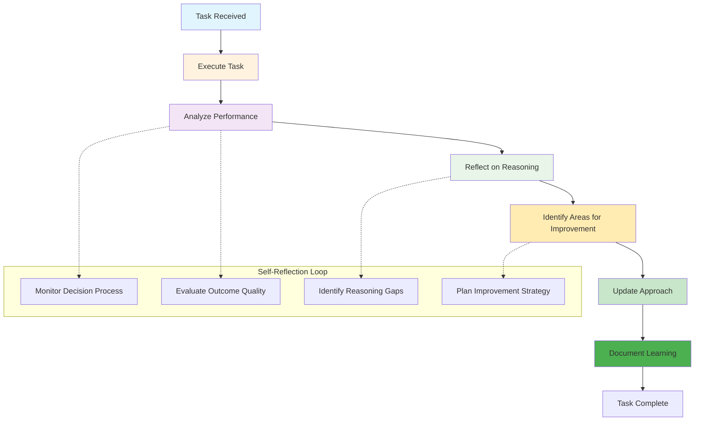
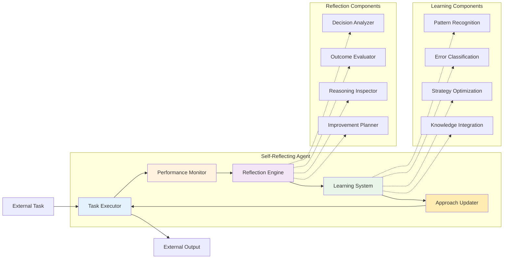

# Level 4: Self-Reflecting – The Philosophers

## Overview

Self-reflecting agents think about their thinking. These agents introduce meta-cognition—they analyze their reasoning, assess their decisions, and learn from mistakes. This enables them to solve tasks, explain their reasoning, and improve over time, ensuring greater reliability and accountability.

## Key Characteristics

- **Meta-cognitive abilities** - Can analyze their own thought processes
- **Self-assessment** - Can evaluate their own performance and decisions
- **Error analysis** - Can identify and learn from mistakes
- **Performance improvement** - Can adjust their approach based on self-reflection
- **Accountability** - Can explain their reasoning and decision-making process

## How It Works



## Architecture Diagram



## Best Use Cases

### ✅ Perfect For:
- **Quality assurance** - Continuous improvement of processes and outputs
- **Process optimization** - Identifying and fixing inefficiencies
- **Error detection and correction** - Learning from mistakes to prevent recurrence
- **Performance monitoring** - Tracking and improving system performance
- **Continuous improvement** - Ongoing enhancement of capabilities
- **Code review** - Analyzing and improving code quality
- **Decision auditing** - Reviewing and improving decision-making processes

### ❌ Not Suitable For:
- **Real-time environmental control** - Tasks requiring immediate system manipulation
- **Personalized experiences** - Tasks requiring user-specific memory
- **Autonomous learning** - Tasks requiring self-directed improvement
- **High-stakes decisions** - Critical decisions without human oversight
- **Tool integration** - Tasks requiring complex multi-system orchestration

## Real-World Examples

### Example 1: Code Review Agent
```python
# Self-reflecting code review agent
class CodeReviewAgent:
    def review_code(self, code, requirements):
        # Step 1: Perform initial code review
        initial_review = self.perform_code_review(code, requirements)
        
        # Step 2: Reflect on review quality
        reflection = self.reflect_on_review_quality(initial_review)
        
        # Step 3: Identify areas for improvement
        improvements = self.identify_review_improvements(reflection)
        
        # Step 4: Update review approach
        updated_approach = self.update_review_approach(improvements)
        
        # Step 5: Perform improved review
        improved_review = self.perform_improved_review(code, requirements, updated_approach)
        
        # Step 6: Document learning
        self.document_learning(reflection, improvements, improved_review)
        
        return improved_review
```

### Example 2: Process Optimization Agent
```python
# Self-reflecting process optimization agent
class ProcessOptimizationAgent:
    def optimize_process(self, process_definition):
        # Step 1: Analyze current process
        analysis = self.analyze_process(process_definition)
        
        # Step 2: Reflect on analysis quality
        reflection = self.reflect_on_analysis_quality(analysis)
        
        # Step 3: Identify optimization opportunities
        opportunities = self.identify_optimization_opportunities(reflection)
        
        # Step 4: Update optimization approach
        updated_approach = self.update_optimization_approach(opportunities)
        
        # Step 5: Implement optimizations
        optimizations = self.implement_optimizations(updated_approach)
        
        # Step 6: Document learning
        self.document_optimization_learning(reflection, opportunities, optimizations)
        
        return optimizations
```

## Implementation Patterns

### Pattern 1: Continuous Self-Assessment
```python
def continuous_self_assessment(agent, task):
    # Execute task
    result = agent.execute_task(task)
    
    # Reflect on performance
    reflection = agent.reflect_on_performance(result)
    
    # Identify improvements
    improvements = agent.identify_improvements(reflection)
    
    # Update approach
    agent.update_approach(improvements)
    
    # Document learning
    agent.document_learning(reflection, improvements)
    
    return result
```

### Pattern 2: Meta-Cognitive Analysis
```python
def meta_cognitive_analysis(agent, decision_process):
    # Analyze decision process
    analysis = agent.analyze_decision_process(decision_process)
    
    # Reflect on reasoning quality
    reflection = agent.reflect_on_reasoning_quality(analysis)
    
    # Identify reasoning gaps
    gaps = agent.identify_reasoning_gaps(reflection)
    
    # Plan improvement strategy
    strategy = agent.plan_improvement_strategy(gaps)
    
    # Implement improvements
    agent.implement_improvements(strategy)
    
    return strategy
```

## Reflection Mechanisms

### Decision Process Analysis
```python
class DecisionProcessAnalyzer:
    def analyze_decision_process(self, decision_process):
        # Analyze decision steps
        steps = self.analyze_decision_steps(decision_process)
        
        # Evaluate decision quality
        quality = self.evaluate_decision_quality(steps)
        
        # Identify decision patterns
        patterns = self.identify_decision_patterns(steps)
        
        return {
            'steps': steps,
            'quality': quality,
            'patterns': patterns
        }
```

### Outcome Evaluation
```python
class OutcomeEvaluator:
    def evaluate_outcome(self, outcome, expected_result):
        # Compare outcome to expected result
        comparison = self.compare_outcome_to_expected(outcome, expected_result)
        
        # Analyze outcome quality
        quality = self.analyze_outcome_quality(comparison)
        
        # Identify improvement areas
        improvements = self.identify_improvement_areas(quality)
        
        return {
            'comparison': comparison,
            'quality': quality,
            'improvements': improvements
        }
```

### Reasoning Inspector
```python
class ReasoningInspector:
    def inspect_reasoning(self, reasoning_process):
        # Analyze reasoning steps
        steps = self.analyze_reasoning_steps(reasoning_process)
        
        # Evaluate reasoning quality
        quality = self.evaluate_reasoning_quality(steps)
        
        # Identify reasoning gaps
        gaps = self.identify_reasoning_gaps(steps)
        
        # Plan reasoning improvements
        improvements = self.plan_reasoning_improvements(gaps)
        
        return {
            'steps': steps,
            'quality': quality,
            'gaps': gaps,
            'improvements': improvements
        }
```

## Implementation Considerations

### Pros:
- **Continuous improvement** - Can learn and adapt over time
- **Self-awareness** - Understands its own limitations and strengths
- **Quality assurance** - Can identify and fix its own errors
- **Accountability** - Can explain its reasoning and decisions
- **Reliability** - Improves performance through self-reflection

### Cons:
- **Computational overhead** - Requires additional processing for reflection
- **Complex implementation** - Difficult to implement reflection mechanisms
- **No external learning** - Cannot learn from other agents or systems
- **Limited scope** - Reflection is limited to its own experiences
- **No memory** - Cannot retain learning across sessions

## When to Choose Self-Reflecting

Choose Self-Reflecting when:
- ✅ You need **continuous improvement** capabilities
- ✅ Tasks require **quality assurance** and **error prevention**
- ✅ You want **self-aware** and **accountable** systems
- ✅ You need **reliable** and **self-correcting** behavior
- ✅ You're dealing with **complex, evolving tasks**

## Common Use Cases

### Use Case 1: Quality Assurance System
```python
def quality_assurance_system(process, quality_standards):
    # Analyze process quality
    quality_analysis = analyze_process_quality(process, quality_standards)
    
    # Reflect on quality analysis
    reflection = reflect_on_quality_analysis(quality_analysis)
    
    # Identify quality improvements
    improvements = identify_quality_improvements(reflection)
    
    # Update quality approach
    updated_approach = update_quality_approach(improvements)
    
    # Implement quality improvements
    quality_improvements = implement_quality_improvements(updated_approach)
    
    return quality_improvements
```

### Use Case 2: Performance Monitoring System
```python
def performance_monitoring_system(system, performance_metrics):
    # Monitor system performance
    performance_data = monitor_system_performance(system, performance_metrics)
    
    # Reflect on performance data
    reflection = reflect_on_performance_data(performance_data)
    
    # Identify performance improvements
    improvements = identify_performance_improvements(reflection)
    
    # Update performance approach
    updated_approach = update_performance_approach(improvements)
    
    # Implement performance improvements
    performance_improvements = implement_performance_improvements(updated_approach)
    
    return performance_improvements
```

## Learning and Improvement

### Pattern Recognition
```python
class PatternRecognizer:
    def recognize_patterns(self, data):
        # Identify patterns in data
        patterns = self.identify_patterns(data)
        
        # Analyze pattern quality
        quality = self.analyze_pattern_quality(patterns)
        
        # Classify patterns
        classification = self.classify_patterns(patterns)
        
        return {
            'patterns': patterns,
            'quality': quality,
            'classification': classification
        }
```

### Strategy Optimization
```python
class StrategyOptimizer:
    def optimize_strategy(self, strategy, performance_data):
        # Analyze strategy performance
        performance = self.analyze_strategy_performance(strategy, performance_data)
        
        # Identify optimization opportunities
        opportunities = self.identify_optimization_opportunities(performance)
        
        # Plan strategy improvements
        improvements = self.plan_strategy_improvements(opportunities)
        
        # Implement strategy improvements
        optimized_strategy = self.implement_strategy_improvements(strategy, improvements)
        
        return optimized_strategy
```

## Next Steps

If you find that your Self-Reflecting agent needs:
- **Memory and personalization** → Consider **Level 5: Memory-Enhanced**
- **Environmental control** → Consider **Level 6: Environment Controllers**
- **Autonomous learning** → Consider **Level 7: Self-Learning**

---

*This agent type is part of the [AI Agent Hierarchy](./Agent-Types.md). Learn about more advanced agent types to find the right solution for your needs.*
