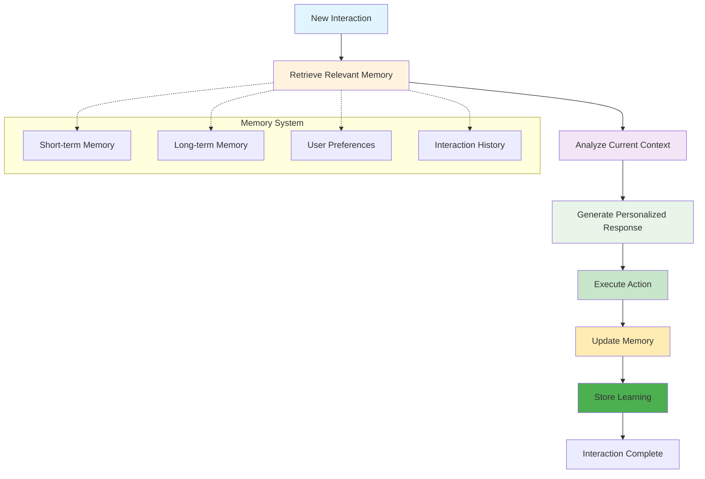
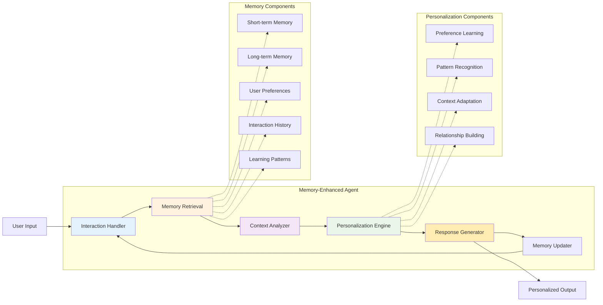

# Level 5: Memory-Enhanced – The Personalized Powerhouses

## Overview

Memory-enhanced agents bring personalization to the forefront by maintaining historical context and remembering user preferences, previous interactions, and task history. They act as adaptive personal assistants, providing tailored experiences and continuous, context-aware support. These agents remember your preferences, track your history, and theoretically would never forget your coffee order.

## Key Characteristics

- **Historical context retention** - Remembers past interactions and context
- **User preference learning** - Learns and adapts to user preferences
- **Personalized experiences** - Provides tailored responses and recommendations
- **Context-aware interactions** - Understands current context based on history
- **Relationship building** - Develops understanding of user patterns and needs

## How It Works



## Architecture Diagram



## Best Use Cases

### ✅ Perfect For:
- **Personal assistants** - Long-term personal productivity support
- **Customer relationship management** - Building and maintaining customer relationships
- **Learning systems** - Adaptive educational and training systems
- **Adaptive interfaces** - User interfaces that adapt to user behavior
- **Long-term project management** - Projects that span extended periods
- **Recommendation systems** - Personalized content and product recommendations
- **Health monitoring** - Tracking and adapting to health patterns

### ❌ Not Suitable For:
- **Real-time environmental control** - Tasks requiring immediate system manipulation
- **Autonomous learning** - Tasks requiring self-directed improvement
- **High-stakes decisions** - Critical decisions without human oversight
- **Tool integration** - Tasks requiring complex multi-system orchestration
- **One-time tasks** - Tasks that don't benefit from historical context

## Real-World Examples

### Example 1: Personal Productivity Agent
```python
# Memory-enhanced personal productivity agent
class PersonalProductivityAgent:
    def __init__(self):
        self.memory = PersonalMemory()
        self.preferences = UserPreferences()
    
    def handle_task(self, task, user_context):
        # Step 1: Retrieve relevant memory
        relevant_memory = self.memory.retrieve_relevant_memory(task, user_context)
        
        # Step 2: Analyze current context
        context = self.analyze_context(task, user_context, relevant_memory)
        
        # Step 3: Generate personalized approach
        approach = self.generate_personalized_approach(task, context, self.preferences)
        
        # Step 4: Execute task
        result = self.execute_task(approach)
        
        # Step 5: Update memory
        self.memory.store_interaction(task, result, user_context)
        
        # Step 6: Learn from interaction
        self.learn_from_interaction(task, result, user_context)
        
        return result
```

### Example 2: Customer Relationship Agent
```python
# Memory-enhanced customer relationship agent
class CustomerRelationshipAgent:
    def __init__(self):
        self.customer_memory = CustomerMemory()
        self.preferences = CustomerPreferences()
    
    def handle_customer_interaction(self, customer_id, interaction):
        # Step 1: Retrieve customer history
        customer_history = self.customer_memory.retrieve_customer_history(customer_id)
        
        # Step 2: Analyze interaction context
        context = self.analyze_interaction_context(interaction, customer_history)
        
        # Step 3: Generate personalized response
        response = self.generate_personalized_response(interaction, context, self.preferences)
        
        # Step 4: Execute interaction
        result = self.execute_interaction(response)
        
        # Step 5: Update customer memory
        self.customer_memory.store_interaction(customer_id, interaction, result)
        
        # Step 6: Learn from interaction
        self.learn_from_customer_interaction(customer_id, interaction, result)
        
        return result
```

## Implementation Patterns

### Pattern 1: Memory-Driven Personalization
```python
def memory_driven_personalization(agent, task, user_context):
    # Retrieve relevant memory
    memory = agent.retrieve_relevant_memory(task, user_context)
    
    # Analyze context with memory
    context = agent.analyze_context_with_memory(task, user_context, memory)
    
    # Generate personalized approach
    approach = agent.generate_personalized_approach(task, context)
    
    # Execute with personalization
    result = agent.execute_personalized_task(approach)
    
    # Update memory
    agent.update_memory(task, result, user_context)
    
    return result
```

### Pattern 2: Preference Learning
```python
def preference_learning(agent, interaction, outcome):
    # Analyze interaction
    interaction_analysis = agent.analyze_interaction(interaction)
    
    # Learn preferences
    preferences = agent.learn_preferences(interaction_analysis, outcome)
    
    # Update preference model
    agent.update_preference_model(preferences)
    
    # Apply learned preferences
    agent.apply_learned_preferences(preferences)
    
    return preferences
```

## Memory Systems

### Short-term Memory
```python
class ShortTermMemory:
    def __init__(self, capacity=100):
        self.capacity = capacity
        self.memories = []
    
    def store(self, memory):
        self.memories.append(memory)
        if len(self.memories) > self.capacity:
            self.memories.pop(0)
    
    def retrieve(self, query):
        relevant_memories = []
        for memory in self.memories:
            if self.is_relevant(memory, query):
                relevant_memories.append(memory)
        return relevant_memories
```

### Long-term Memory
```python
class LongTermMemory:
    def __init__(self):
        self.memories = {}
        self.index = {}
    
    def store(self, memory):
        memory_id = self.generate_memory_id(memory)
        self.memories[memory_id] = memory
        self.index_memory(memory_id, memory)
    
    def retrieve(self, query):
        relevant_ids = self.search_index(query)
        relevant_memories = []
        for memory_id in relevant_ids:
            relevant_memories.append(self.memories[memory_id])
        return relevant_memories
```

### User Preferences
```python
class UserPreferences:
    def __init__(self):
        self.preferences = {}
        self.preference_history = []
    
    def learn_preference(self, interaction, outcome):
        preference = self.extract_preference(interaction, outcome)
        self.preferences[preference.key] = preference.value
        self.preference_history.append(preference)
    
    def get_preference(self, key):
        return self.preferences.get(key)
```

## Personalization Mechanisms

### Context Adaptation
```python
class ContextAdapter:
    def adapt_to_context(self, task, context, memory):
        # Analyze current context
        context_analysis = self.analyze_context(context)
        
        # Retrieve relevant memory
        relevant_memory = self.retrieve_relevant_memory(task, context_analysis)
        
        # Adapt approach based on context and memory
        adapted_approach = self.adapt_approach(task, context_analysis, relevant_memory)
        
        return adapted_approach
```

### Pattern Recognition
```python
class PatternRecognizer:
    def recognize_patterns(self, interaction_history):
        # Analyze interaction patterns
        patterns = self.analyze_interaction_patterns(interaction_history)
        
        # Identify user preferences
        preferences = self.identify_user_preferences(patterns)
        
        # Recognize behavioral patterns
        behavioral_patterns = self.recognize_behavioral_patterns(patterns)
        
        return {
            'patterns': patterns,
            'preferences': preferences,
            'behavioral_patterns': behavioral_patterns
        }
```

### Relationship Building
```python
class RelationshipBuilder:
    def build_relationship(self, user_id, interaction_history):
        # Analyze relationship history
        relationship_analysis = self.analyze_relationship_history(interaction_history)
        
        # Identify relationship patterns
        patterns = self.identify_relationship_patterns(relationship_analysis)
        
        # Build relationship model
        relationship_model = self.build_relationship_model(patterns)
        
        # Update relationship understanding
        self.update_relationship_understanding(user_id, relationship_model)
        
        return relationship_model
```

## Implementation Considerations

### Pros:
- **Personalized experiences** - Tailored responses and recommendations
- **Context awareness** - Understands current context based on history
- **Relationship building** - Develops understanding of user patterns
- **Adaptive behavior** - Adjusts to user preferences over time
- **Long-term learning** - Improves performance through accumulated experience

### Cons:
- **Privacy concerns** - Requires careful handling of personal data
- **Memory management** - Complex memory storage and retrieval systems
- **Computational overhead** - Additional processing for memory operations
- **Data dependency** - Quality depends on historical data quality
- **No external learning** - Cannot learn from other agents or systems

## When to Choose Memory-Enhanced

Choose Memory-Enhanced when:
- ✅ You need **personalized experiences** and **user adaptation**
- ✅ Tasks benefit from **historical context** and **user preferences**
- ✅ You want **long-term relationship building** capabilities
- ✅ You need **context-aware** and **adaptive** behavior
- ✅ You're dealing with **user-facing applications** that benefit from personalization

## Common Use Cases

### Use Case 1: Personal Assistant
```python
def personal_assistant_system(user_id, task, user_context):
    # Retrieve user memory
    user_memory = retrieve_user_memory(user_id)
    
    # Analyze context with memory
    context = analyze_context_with_memory(task, user_context, user_memory)
    
    # Generate personalized approach
    approach = generate_personalized_approach(task, context)
    
    # Execute personalized task
    result = execute_personalized_task(approach)
    
    # Update user memory
    update_user_memory(user_id, task, result, user_context)
    
    return result
```

### Use Case 2: Recommendation System
```python
def recommendation_system(user_id, content, user_preferences):
    # Retrieve user preferences
    preferences = retrieve_user_preferences(user_id)
    
    # Analyze content with preferences
    analysis = analyze_content_with_preferences(content, preferences)
    
    # Generate personalized recommendations
    recommendations = generate_personalized_recommendations(analysis)
    
    # Update user preferences
    update_user_preferences(user_id, content, recommendations)
    
    return recommendations
```

## Memory Management

### Memory Storage
```python
class MemoryStorage:
    def __init__(self):
        self.storage = {}
        self.index = {}
    
    def store(self, memory):
        memory_id = self.generate_id(memory)
        self.storage[memory_id] = memory
        self.index_memory(memory_id, memory)
    
    def retrieve(self, query):
        relevant_ids = self.search_index(query)
        return [self.storage[id] for id in relevant_ids]
```

### Memory Indexing
```python
class MemoryIndexer:
    def __init__(self):
        self.index = {}
    
    def index_memory(self, memory_id, memory):
        # Extract keywords
        keywords = self.extract_keywords(memory)
        
        # Index by keywords
        for keyword in keywords:
            if keyword not in self.index:
                self.index[keyword] = []
            self.index[keyword].append(memory_id)
    
    def search_index(self, query):
        keywords = self.extract_keywords(query)
        relevant_ids = set()
        for keyword in keywords:
            if keyword in self.index:
                relevant_ids.update(self.index[keyword])
        return list(relevant_ids)
```

## Next Steps

If you find that your Memory-Enhanced agent needs:
- **Environmental control** → Consider **Level 6: Environment Controllers**
- **Autonomous learning** → Consider **Level 7: Self-Learning**

---

*This agent type is part of the [AI Agent Hierarchy](./Agent-Types.md). Learn about more advanced agent types to find the right solution for your needs.*
