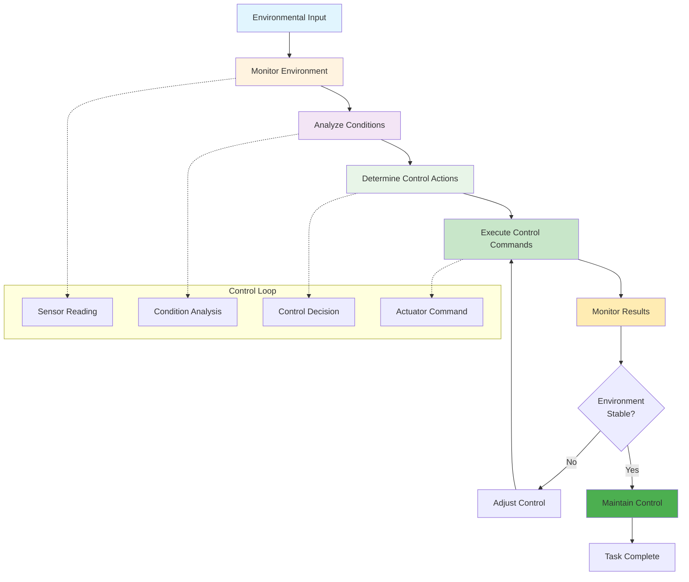
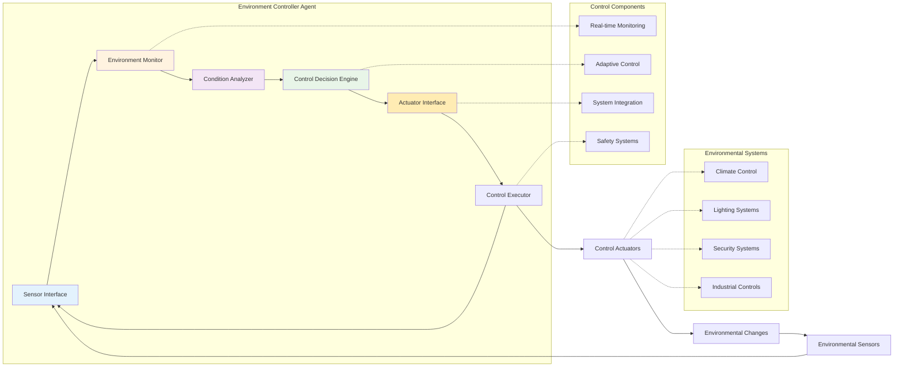

# Level 6: Environment Controllers – The World Shapers

## Overview

Environment-controlling agents extend beyond decision-making and interaction—they actively manipulate and control environments in real time. These agents are equipped to perform tasks that influence the digital landscape or the physical world, making them ideal for automation, robotics, and adaptive systems applications. Think smart thermostats, but on steroids.

## Key Characteristics

- **Real-time environment control** - Can manipulate systems and environments immediately
- **System manipulation** - Can modify system parameters and configurations
- **Adaptive responses** - Can respond to environmental changes in real-time
- **Environmental monitoring** - Can track and analyze environmental conditions
- **Control system integration** - Can interface with various control systems

## How It Works



## Architecture Diagram



## Best Use Cases

### ✅ Perfect For:
- **Smart home automation** - Controlling lighting, temperature, security systems
- **Industrial control systems** - Manufacturing and process control
- **Environmental monitoring** - Climate control and environmental management
- **Infrastructure management** - Building and city infrastructure control
- **Robotics applications** - Physical robot control and manipulation
- **Energy management** - Smart grid and energy distribution control
- **Traffic management** - Intelligent transportation systems

### ❌ Not Suitable For:
- **Personalized experiences** - Tasks requiring user-specific memory
- **Autonomous learning** - Tasks requiring self-directed improvement
- **High-stakes decisions** - Critical decisions without human oversight
- **Tool integration** - Tasks requiring complex multi-system orchestration
- **One-time tasks** - Tasks that don't benefit from environmental control

## Real-World Examples

### Example 1: Smart Building Management
```python
# Environment controller for smart building
class SmartBuildingController:
    def __init__(self):
        self.sensors = BuildingSensors()
        self.actuators = BuildingActuators()
        self.control_system = BuildingControlSystem()
    
    def control_building_environment(self):
        # Step 1: Monitor building conditions
        conditions = self.sensors.read_all_conditions()
        
        # Step 2: Analyze environmental data
        analysis = self.analyze_environmental_data(conditions)
        
        # Step 3: Determine control actions
        control_actions = self.determine_control_actions(analysis)
        
        # Step 4: Execute control commands
        for action in control_actions:
            result = self.actuators.execute_control(action)
            if result.success:
                self.control_system.log_success(action)
            else:
                self.control_system.handle_failure(action, result)
        
        # Step 5: Monitor results
        self.monitor_control_results(control_actions)
        
        return self.control_system.get_control_summary()
```

### Example 2: Industrial Process Control
```python
# Environment controller for industrial process
class IndustrialProcessController:
    def __init__(self):
        self.process_sensors = ProcessSensors()
        self.process_actuators = ProcessActuators()
        self.control_system = ProcessControlSystem()
    
    def control_industrial_process(self, process_parameters):
        # Step 1: Monitor process conditions
        process_data = self.process_sensors.read_process_data()
        
        # Step 2: Analyze process performance
        performance = self.analyze_process_performance(process_data, process_parameters)
        
        # Step 3: Determine process adjustments
        adjustments = self.determine_process_adjustments(performance)
        
        # Step 4: Execute process control
        for adjustment in adjustments:
            result = self.process_actuators.execute_adjustment(adjustment)
            if result.success:
                self.control_system.log_adjustment(adjustment)
            else:
                self.control_system.handle_adjustment_failure(adjustment, result)
        
        # Step 5: Monitor process stability
        self.monitor_process_stability(adjustments)
        
        return self.control_system.get_process_summary()
```

## Implementation Patterns

### Pattern 1: Real-time Control Loop
```python
def real_time_control_loop(controller, target_conditions):
    while True:
        # Read current conditions
        current_conditions = controller.read_conditions()
        
        # Analyze conditions
        analysis = controller.analyze_conditions(current_conditions, target_conditions)
        
        # Determine control actions
        actions = controller.determine_control_actions(analysis)
        
        # Execute control actions
        for action in actions:
            controller.execute_control_action(action)
        
        # Monitor results
        controller.monitor_control_results(actions)
        
        # Check for stability
        if controller.is_stable():
            break
```

### Pattern 2: Adaptive Control System
```python
def adaptive_control_system(controller, control_objectives):
    # Initialize control system
    controller.initialize_control_system(control_objectives)
    
    # Start control loop
    while controller.is_control_active():
        # Monitor environment
        environment_data = controller.monitor_environment()
        
        # Analyze environment
        analysis = controller.analyze_environment(environment_data)
        
        # Adapt control strategy
        strategy = controller.adapt_control_strategy(analysis)
        
        # Execute adaptive control
        result = controller.execute_adaptive_control(strategy)
        
        # Learn from results
        controller.learn_from_control_result(result)
```

## Control Systems

### Sensor Interface
```python
class SensorInterface:
    def __init__(self, sensor_config):
        self.sensors = self.initialize_sensors(sensor_config)
        self.data_buffer = DataBuffer()
    
    def read_sensor_data(self):
        data = {}
        for sensor in self.sensors:
            reading = sensor.read()
            data[sensor.name] = reading
            self.data_buffer.store(sensor.name, reading)
        return data
    
    def get_sensor_history(self, sensor_name, time_range):
        return self.data_buffer.get_history(sensor_name, time_range)
```

### Actuator Interface
```python
class ActuatorInterface:
    def __init__(self, actuator_config):
        self.actuators = self.initialize_actuators(actuator_config)
        self.control_log = ControlLog()
    
    def execute_control_command(self, command):
        actuator = self.actuators[command.actuator_name]
        result = actuator.execute(command)
        self.control_log.log_command(command, result)
        return result
    
    def get_actuator_status(self, actuator_name):
        return self.actuators[actuator_name].get_status()
```

### Control Decision Engine
```python
class ControlDecisionEngine:
    def __init__(self, control_rules):
        self.control_rules = control_rules
        self.decision_history = DecisionHistory()
    
    def make_control_decision(self, sensor_data, target_conditions):
        # Analyze current conditions
        analysis = self.analyze_conditions(sensor_data, target_conditions)
        
        # Apply control rules
        decisions = self.apply_control_rules(analysis)
        
        # Log decisions
        self.decision_history.log_decisions(decisions)
        
        return decisions
```

## Environmental Monitoring

### Real-time Monitoring
```python
class RealTimeMonitor:
    def __init__(self, monitoring_config):
        self.monitoring_config = monitoring_config
        self.monitoring_system = MonitoringSystem(monitoring_config)
    
    def monitor_environment(self):
        # Start monitoring
        self.monitoring_system.start_monitoring()
        
        # Process monitoring data
        while self.monitoring_system.is_monitoring():
            data = self.monitoring_system.get_latest_data()
            self.process_monitoring_data(data)
    
    def process_monitoring_data(self, data):
        # Analyze data
        analysis = self.analyze_monitoring_data(data)
        
        # Check for alerts
        alerts = self.check_for_alerts(analysis)
        
        # Handle alerts
        for alert in alerts:
            self.handle_alert(alert)
```

### Adaptive Control
```python
class AdaptiveController:
    def __init__(self, control_parameters):
        self.control_parameters = control_parameters
        self.adaptation_system = AdaptationSystem()
    
    def adapt_control(self, performance_data):
        # Analyze performance
        performance_analysis = self.analyze_performance(performance_data)
        
        # Determine adaptations
        adaptations = self.determine_adaptations(performance_analysis)
        
        # Apply adaptations
        for adaptation in adaptations:
            self.apply_adaptation(adaptation)
        
        # Monitor adaptation results
        self.monitor_adaptation_results(adaptations)
```

## Implementation Considerations

### Pros:
- **Real-time control** - Can respond immediately to environmental changes
- **System integration** - Can interface with various control systems
- **Adaptive behavior** - Can adjust control based on environmental feedback
- **Automation** - Can automate complex environmental control tasks
- **Efficiency** - Can optimize environmental conditions for efficiency

### Cons:
- **Safety concerns** - Requires careful safety systems and fail-safes
- **Complex integration** - Difficult to integrate with existing systems
- **Real-time requirements** - Requires high-performance, low-latency systems
- **Environmental dependency** - Quality depends on sensor and actuator reliability
- **No learning** - Cannot improve from past experiences

## When to Choose Environment Controllers

Choose Environment Controllers when:
- ✅ You need **real-time environmental control**
- ✅ Tasks require **system manipulation** and **actuator control**
- ✅ You want **automated environmental management**
- ✅ You need **adaptive control** based on environmental feedback
- ✅ You're dealing with **physical systems** that require control

## Common Use Cases

### Use Case 1: Smart Home Automation
```python
def smart_home_automation(home_config, user_preferences):
    # Initialize home control system
    home_controller = HomeController(home_config)
    
    # Set up user preferences
    home_controller.set_user_preferences(user_preferences)
    
    # Start automation
    while home_controller.is_automation_active():
        # Monitor home conditions
        conditions = home_controller.monitor_home_conditions()
        
        # Analyze conditions
        analysis = home_controller.analyze_conditions(conditions)
        
        # Determine control actions
        actions = home_controller.determine_control_actions(analysis)
        
        # Execute control actions
        for action in actions:
            home_controller.execute_control_action(action)
        
        # Monitor results
        home_controller.monitor_control_results(actions)
```

### Use Case 2: Industrial Process Control
```python
def industrial_process_control(process_config, control_objectives):
    # Initialize process controller
    process_controller = ProcessController(process_config)
    
    # Set control objectives
    process_controller.set_control_objectives(control_objectives)
    
    # Start process control
    while process_controller.is_process_active():
        # Monitor process conditions
        process_data = process_controller.monitor_process_conditions()
        
        # Analyze process performance
        performance = process_controller.analyze_process_performance(process_data)
        
        # Determine process adjustments
        adjustments = process_controller.determine_process_adjustments(performance)
        
        # Execute process control
        for adjustment in adjustments:
            process_controller.execute_process_adjustment(adjustment)
        
        # Monitor process stability
        process_controller.monitor_process_stability(adjustments)
```

## Safety Systems

### Safety Monitoring
```python
class SafetyMonitor:
    def __init__(self, safety_rules):
        self.safety_rules = safety_rules
        self.safety_system = SafetySystem()
    
    def monitor_safety(self, control_actions):
        # Check safety rules
        safety_violations = self.check_safety_rules(control_actions)
        
        # Handle safety violations
        for violation in safety_violations:
            self.handle_safety_violation(violation)
        
        # Monitor safety systems
        self.monitor_safety_systems()
```

### Fail-safe Systems
```python
class FailSafeSystem:
    def __init__(self, fail_safe_config):
        self.fail_safe_config = fail_safe_config
        self.fail_safe_system = FailSafeSystem(fail_safe_config)
    
    def implement_fail_safe(self, control_system):
        # Set up fail-safe systems
        self.fail_safe_system.setup_fail_safe(control_system)
        
        # Monitor for failures
        while self.fail_safe_system.is_monitoring():
            if self.fail_safe_system.detect_failure():
                self.fail_safe_system.activate_fail_safe()
```

## Next Steps

If you find that your Environment Controller agent needs:
- **Autonomous learning** → Consider **Level 7: Self-Learning**

---

*This agent type is part of the [AI Agent Hierarchy](./Agent-Types.md). Learn about more advanced agent types to find the right solution for your needs.*
