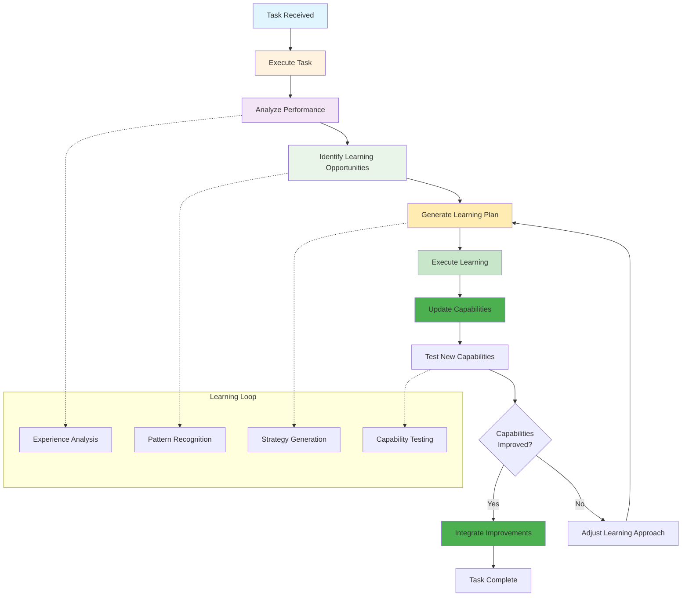
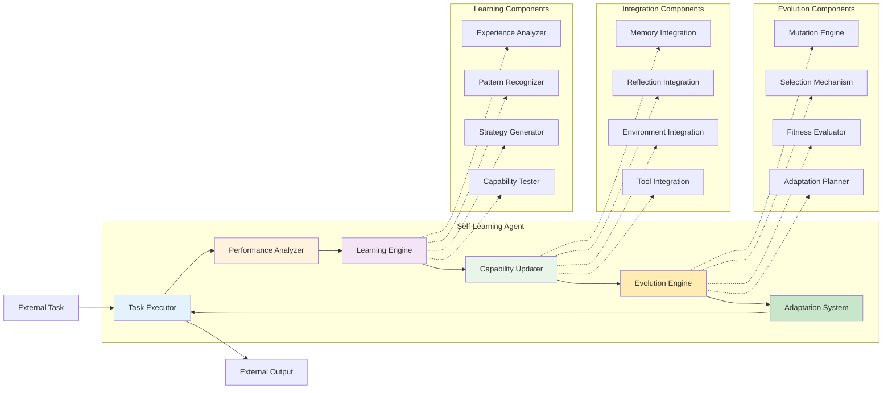

# Level 7: Self-Learning – The Evolutionaries

## Overview

The holy grail of AI agents: those that can improve themselves over time. They learn, adapt, and evolve without needing constant babysitting. These agents improve themselves over time, learning from interactions, adapting to new environments, and evolving without constant human intervention. They combine elements of reasoning, memory, environment control, and self-reflection with autonomous learning capabilities to adapt and optimize their behavior.

## Key Characteristics

- **Autonomous learning** - Can learn and improve without human intervention
- **Self-improvement** - Can enhance their own capabilities over time
- **Evolutionary capabilities** - Can evolve and adapt to new environments
- **Adaptive optimization** - Can optimize their behavior based on experience
- **Independent evolution** - Can develop new capabilities autonomously

## How It Works



## Architecture Diagram



## Best Use Cases

### ✅ Perfect For:
- **Research and development** - Autonomous scientific research and innovation
- **Complex system optimization** - Self-improving system optimization
- **Autonomous problem solving** - Independent problem identification and solution
- **Innovation and discovery** - Autonomous innovation and discovery processes
- **Long-term strategic planning** - Self-evolving strategic planning
- **Adaptive systems** - Systems that need to evolve with changing requirements
- **Exploratory tasks** - Tasks requiring autonomous exploration and discovery

### ❌ Not Suitable For:
- **High-stakes decisions** - Critical decisions without human oversight
- **Personalized experiences** - Tasks requiring user-specific memory
- **Real-time control** - Tasks requiring immediate system manipulation
- **Tool integration** - Tasks requiring complex multi-system orchestration
- **One-time tasks** - Tasks that don't benefit from learning and evolution

## Real-World Examples

### Example 1: Autonomous Research Agent
```python
# Self-learning research agent
class AutonomousResearchAgent:
    def __init__(self):
        self.learning_system = LearningSystem()
        self.evolution_engine = EvolutionEngine()
        self.capability_system = CapabilitySystem()
    
    def conduct_autonomous_research(self, research_domain):
        # Step 1: Analyze research domain
        domain_analysis = self.analyze_research_domain(research_domain)
        
        # Step 2: Generate research strategy
        strategy = self.generate_research_strategy(domain_analysis)
        
        # Step 3: Execute research
        research_results = self.execute_research(strategy)
        
        # Step 4: Learn from research
        learning = self.learn_from_research(research_results)
        
        # Step 5: Evolve capabilities
        evolved_capabilities = self.evolve_capabilities(learning)
        
        # Step 6: Test new capabilities
        capability_test = self.test_new_capabilities(evolved_capabilities)
        
        # Step 7: Integrate improvements
        if capability_test.success:
            self.integrate_capability_improvements(evolved_capabilities)
        
        return research_results
```

### Example 2: Adaptive System Optimizer
```python
# Self-learning system optimizer
class AdaptiveSystemOptimizer:
    def __init__(self):
        self.optimization_system = OptimizationSystem()
        self.learning_engine = LearningEngine()
        self.evolution_system = EvolutionSystem()
    
    def optimize_system(self, system_config, optimization_goals):
        # Step 1: Analyze system
        system_analysis = self.analyze_system(system_config)
        
        # Step 2: Generate optimization strategy
        strategy = self.generate_optimization_strategy(system_analysis, optimization_goals)
        
        # Step 3: Execute optimization
        optimization_results = self.execute_optimization(strategy)
        
        # Step 4: Learn from optimization
        learning = self.learn_from_optimization(optimization_results)
        
        # Step 5: Evolve optimization approach
        evolved_approach = self.evolve_optimization_approach(learning)
        
        # Step 6: Test evolved approach
        approach_test = self.test_evolved_approach(evolved_approach)
        
        # Step 7: Integrate improvements
        if approach_test.success:
            self.integrate_optimization_improvements(evolved_approach)
        
        return optimization_results
```

## Implementation Patterns

### Pattern 1: Autonomous Learning Loop
```python
def autonomous_learning_loop(agent, task):
    # Execute task
    result = agent.execute_task(task)
    
    # Analyze performance
    performance = agent.analyze_performance(result)
    
    # Identify learning opportunities
    opportunities = agent.identify_learning_opportunities(performance)
    
    # Generate learning plan
    learning_plan = agent.generate_learning_plan(opportunities)
    
    # Execute learning
    learning_result = agent.execute_learning(learning_plan)
    
    # Update capabilities
    agent.update_capabilities(learning_result)
    
    # Test new capabilities
    capability_test = agent.test_new_capabilities()
    
    # Integrate improvements
    if capability_test.success:
        agent.integrate_improvements()
    
    return result
```

### Pattern 2: Evolutionary Adaptation
```python
def evolutionary_adaptation(agent, environment):
    # Analyze environment
    environment_analysis = agent.analyze_environment(environment)
    
    # Generate adaptation strategy
    strategy = agent.generate_adaptation_strategy(environment_analysis)
    
    # Execute adaptation
    adaptation_result = agent.execute_adaptation(strategy)
    
    # Evaluate adaptation
    evaluation = agent.evaluate_adaptation(adaptation_result)
    
    # Evolve based on evaluation
    evolution = agent.evolve_based_on_evaluation(evaluation)
    
    # Test evolution
    evolution_test = agent.test_evolution(evolution)
    
    # Integrate evolution
    if evolution_test.success:
        agent.integrate_evolution(evolution)
    
    return adaptation_result
```

## Learning Systems

### Experience Analyzer
```python
class ExperienceAnalyzer:
    def __init__(self):
        self.experience_memory = ExperienceMemory()
        self.analysis_engine = AnalysisEngine()
    
    def analyze_experience(self, experience):
        # Analyze experience patterns
        patterns = self.analyze_experience_patterns(experience)
        
        # Extract learning insights
        insights = self.extract_learning_insights(patterns)
        
        # Generate learning recommendations
        recommendations = self.generate_learning_recommendations(insights)
        
        return {
            'patterns': patterns,
            'insights': insights,
            'recommendations': recommendations
        }
```

### Pattern Recognizer
```python
class PatternRecognizer:
    def __init__(self):
        self.pattern_database = PatternDatabase()
        self.recognition_engine = RecognitionEngine()
    
    def recognize_patterns(self, data):
        # Identify patterns in data
        patterns = self.identify_patterns(data)
        
        # Classify patterns
        classification = self.classify_patterns(patterns)
        
        # Generate pattern insights
        insights = self.generate_pattern_insights(patterns, classification)
        
        return {
            'patterns': patterns,
            'classification': classification,
            'insights': insights
        }
```

### Strategy Generator
```python
class StrategyGenerator:
    def __init__(self):
        self.strategy_engine = StrategyEngine()
        self.optimization_system = OptimizationSystem()
    
    def generate_strategy(self, context, goals):
        # Analyze context
        context_analysis = self.analyze_context(context)
        
        # Generate strategy options
        options = self.generate_strategy_options(context_analysis, goals)
        
        # Optimize strategy
        optimized_strategy = self.optimize_strategy(options)
        
        # Test strategy
        strategy_test = self.test_strategy(optimized_strategy)
        
        return optimized_strategy
```

## Evolution Systems

### Mutation Engine
```python
class MutationEngine:
    def __init__(self):
        self.mutation_rules = MutationRules()
        self.mutation_system = MutationSystem()
    
    def mutate_capabilities(self, capabilities):
        # Generate mutations
        mutations = self.generate_mutations(capabilities)
        
        # Apply mutations
        mutated_capabilities = self.apply_mutations(capabilities, mutations)
        
        # Test mutations
        mutation_test = self.test_mutations(mutated_capabilities)
        
        return mutated_capabilities
```

### Selection Mechanism
```python
class SelectionMechanism:
    def __init__(self):
        self.fitness_evaluator = FitnessEvaluator()
        self.selection_system = SelectionSystem()
    
    def select_capabilities(self, capability_pool):
        # Evaluate fitness
        fitness_scores = self.evaluate_fitness(capability_pool)
        
        # Select best capabilities
        selected_capabilities = self.select_best_capabilities(capability_pool, fitness_scores)
        
        # Generate new capabilities
        new_capabilities = self.generate_new_capabilities(selected_capabilities)
        
        return new_capabilities
```

### Fitness Evaluator
```python
class FitnessEvaluator:
    def __init__(self):
        self.fitness_metrics = FitnessMetrics()
        self.evaluation_system = EvaluationSystem()
    
    def evaluate_fitness(self, capabilities):
        # Evaluate performance
        performance = self.evaluate_performance(capabilities)
        
        # Evaluate adaptability
        adaptability = self.evaluate_adaptability(capabilities)
        
        # Evaluate efficiency
        efficiency = self.evaluate_efficiency(capabilities)
        
        # Calculate fitness score
        fitness_score = self.calculate_fitness_score(performance, adaptability, efficiency)
        
        return fitness_score
```

## Implementation Considerations

### Pros:
- **Autonomous improvement** - Can learn and improve without human intervention
- **Evolutionary capabilities** - Can evolve and adapt to new environments
- **Self-optimization** - Can optimize its own behavior and performance
- **Innovation potential** - Can discover new approaches and solutions
- **Long-term learning** - Can accumulate knowledge and improve over time

### Cons:
- **Unpredictable behavior** - May develop unexpected capabilities or behaviors
- **Safety concerns** - Requires careful oversight and safety systems
- **Computational intensive** - Requires significant computational resources
- **Complex implementation** - Difficult to implement and maintain
- **Ethical considerations** - Raises questions about AI autonomy and control

## When to Choose Self-Learning

Choose Self-Learning when:
- ✅ You need **autonomous improvement** and **evolutionary capabilities**
- ✅ Tasks require **long-term learning** and **adaptation**
- ✅ You want **innovative solutions** and **creative problem-solving**
- ✅ You need **self-optimizing systems** that improve over time
- ✅ You're dealing with **complex, evolving problems** that benefit from autonomous learning

## Common Use Cases

### Use Case 1: Autonomous Research System
```python
def autonomous_research_system(research_domain, research_goals):
    # Initialize research agent
    research_agent = AutonomousResearchAgent()
    
    # Set research goals
    research_agent.set_research_goals(research_goals)
    
    # Start autonomous research
    while research_agent.is_research_active():
        # Conduct research
        research_result = research_agent.conduct_research(research_domain)
        
        # Learn from research
        learning = research_agent.learn_from_research(research_result)
        
        # Evolve capabilities
        evolution = research_agent.evolve_capabilities(learning)
        
        # Test evolution
        evolution_test = research_agent.test_evolution(evolution)
        
        # Integrate improvements
        if evolution_test.success:
            research_agent.integrate_improvements(evolution)
```

### Use Case 2: Adaptive System Optimizer
```python
def adaptive_system_optimizer(system_config, optimization_goals):
    # Initialize optimizer
    optimizer = AdaptiveSystemOptimizer()
    
    # Set optimization goals
    optimizer.set_optimization_goals(optimization_goals)
    
    # Start adaptive optimization
    while optimizer.is_optimization_active():
        # Optimize system
        optimization_result = optimizer.optimize_system(system_config)
        
        # Learn from optimization
        learning = optimizer.learn_from_optimization(optimization_result)
        
        # Evolve approach
        evolution = optimizer.evolve_optimization_approach(learning)
        
        # Test evolution
        evolution_test = optimizer.test_evolution(evolution)
        
        # Integrate improvements
        if evolution_test.success:
            optimizer.integrate_improvements(evolution)
```

## Safety and Oversight

### Safety Systems
```python
class SafetySystem:
    def __init__(self, safety_rules):
        self.safety_rules = safety_rules
        self.safety_monitor = SafetyMonitor()
    
    def monitor_safety(self, agent_behavior):
        # Check safety rules
        safety_violations = self.check_safety_rules(agent_behavior)
        
        # Handle safety violations
        for violation in safety_violations:
            self.handle_safety_violation(violation)
        
        # Monitor agent behavior
        self.monitor_agent_behavior(agent_behavior)
```

### Oversight Systems
```python
class OversightSystem:
    def __init__(self, oversight_config):
        self.oversight_config = oversight_config
        self.oversight_monitor = OversightMonitor()
    
    def provide_oversight(self, agent_learning):
        # Monitor learning process
        learning_monitor = self.monitor_learning_process(agent_learning)
        
        # Check for concerning patterns
        concerning_patterns = self.check_concerning_patterns(learning_monitor)
        
        # Handle concerning patterns
        for pattern in concerning_patterns:
            self.handle_concerning_pattern(pattern)
        
        # Provide oversight feedback
        self.provide_oversight_feedback(agent_learning)
```

## Ethical Considerations

### Autonomy vs. Control
```python
class AutonomyController:
    def __init__(self, autonomy_limits):
        self.autonomy_limits = autonomy_limits
        self.control_system = ControlSystem()
    
    def manage_autonomy(self, agent_autonomy):
        # Check autonomy limits
        autonomy_violations = self.check_autonomy_limits(agent_autonomy)
        
        # Handle autonomy violations
        for violation in autonomy_violations:
            self.handle_autonomy_violation(violation)
        
        # Adjust autonomy level
        adjusted_autonomy = self.adjust_autonomy_level(agent_autonomy)
        
        return adjusted_autonomy
```

### Transparency and Accountability
```python
class TransparencySystem:
    def __init__(self, transparency_config):
        self.transparency_config = transparency_config
        self.transparency_monitor = TransparencyMonitor()
    
    def ensure_transparency(self, agent_behavior):
        # Monitor agent behavior
        behavior_monitor = self.monitor_agent_behavior(agent_behavior)
        
        # Ensure transparency
        transparency = self.ensure_behavior_transparency(behavior_monitor)
        
        # Provide accountability
        accountability = self.provide_accountability(transparency)
        
        return accountability
```

## Next Steps

This represents the pinnacle of AI agent development. Self-learning agents are the most advanced and capable agents, but they also require the most careful oversight and ethical consideration. They represent the future of AI, where systems can truly learn, adapt, and evolve autonomously.

---

*This agent type is part of the [AI Agent Hierarchy](./Agent-Types.md). This represents the most advanced level of AI agent development, combining all previous capabilities with autonomous learning and evolution.*
